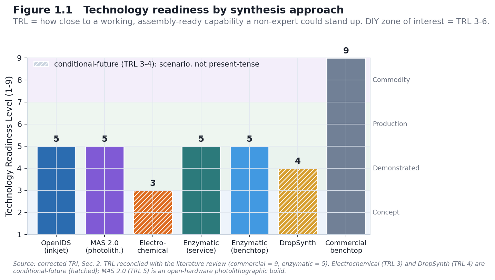
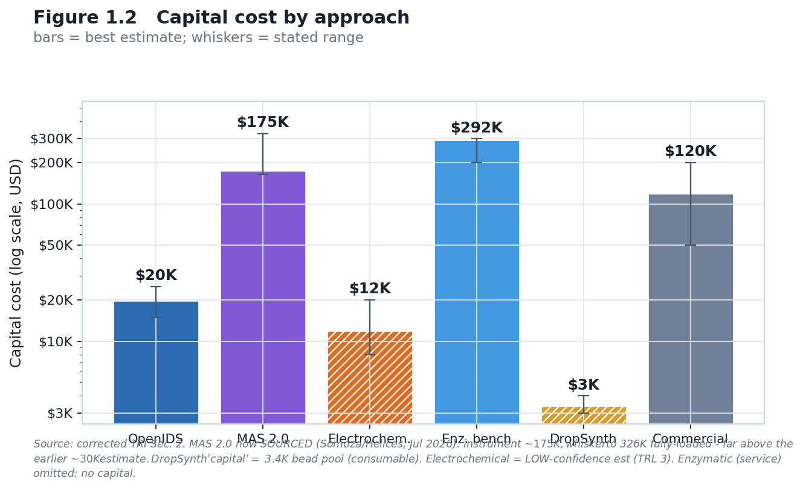
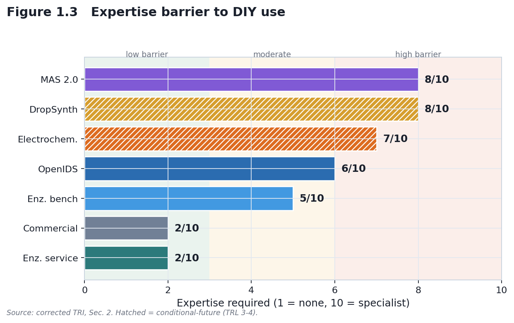
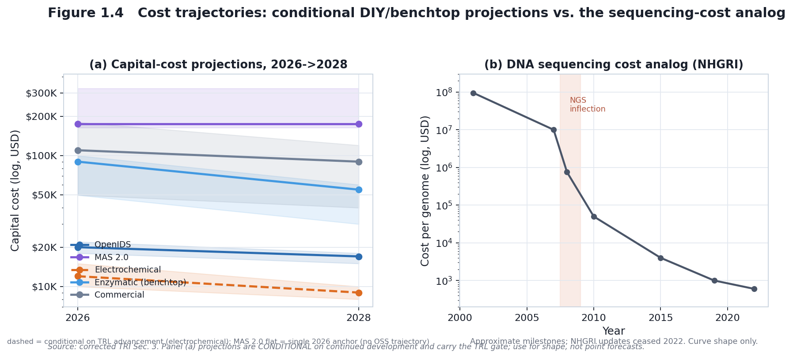
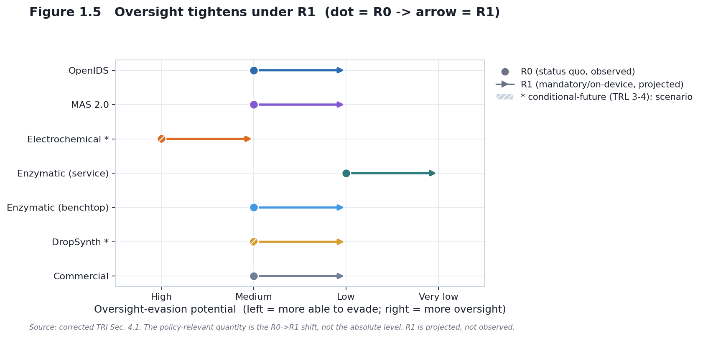
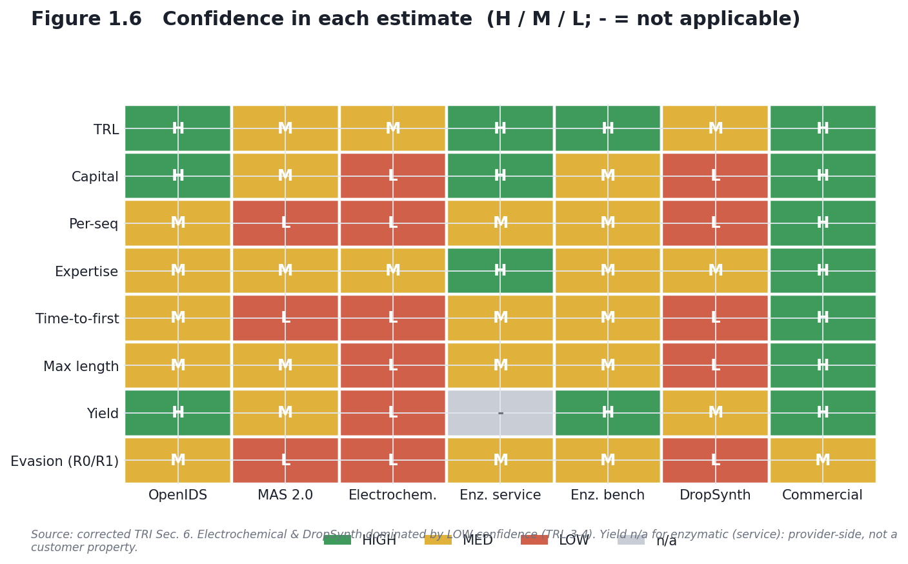

# PART 1: REGIME-CONDITIONAL TECHNOLOGY READINESS INDEX (TRI)

## DIY DNA Oligonucleotide Synthesis Approaches Under Governance Transitions

*Draft — corrected July 2026*

**Scope:** Synthesis-step characterization only (sequence acquisition, assembly, pathogen rescue, and deployment are OUT OF SCOPE).
**Regimes:** R0 (status quo, **October 2026 — present**) vs R1 (projected regime in which mandatory synthesis screening and **on-device benchtop screening** are in force). The analytical focus is the **residual DIY gap** — synthesis capability that remains outside the screening perimeter once commercial providers and benchtop manufacturers are covered.

**Scope note:** This analysis characterizes seven DNA oligonucleotide synthesis approaches across nine technical and governance dimensions: (1) Technology Readiness Level (TRL), (2) capital cost, (3) per-sequence cost, (4) expertise required, (5) time-to-first-synthesis, (6) maximum sequence length, (7) synthesis yield, (8) oversight-evasion potential (regime-paired, R0/R1), and (9) supply-chain vulnerability (regime-paired, R0/R1). The analysis applies a **regime-conditional framework** to understand how governance changes between October 2026 (R0, present) and the projected mandatory / on-device regime (R1) affect the accessibility, evasion potential, and control-point robustness of each method.

---

## 1. INTRODUCTION & SCOPE

### 1.1 Governance Regime Definitions

The two regimes are defined below. **R0 is observed; R1 is a projection assembled from two distinct policy instruments whose implementation has not yet occurred.** Those two instruments — a bill (S. 3741) and a technical framework (the OSTP screening framework) — are kept explicitly separate, because they do different things and have different enforcement pathways. Conflating them was an error in earlier drafts and is corrected here.

#### Regime 0 (R0): Status Quo, October 2026 (present)

- The **OSTP Framework for Nucleic Acid Synthesis Screening** (April 2024) was directed to be *revised or replaced* by **Executive Order 14292** (*Improving the Safety and Security of Biological Research*, May 5, 2025). During the interim, no mandatory federal synthesis-screening requirement is in force.
- **IGSC Harmonized Screening Protocol v3.0** (September 2024): voluntary; member companies self-regulate.
- No on-device screening requirement for benchtop synthesizer manufacturers.
- No bulk-nucleotide or reagent monitoring mandate.
- Synthesis screening relies on voluntary provider compliance (IGSC v3.0).

*Sources:* Executive Order 14292 (Federal Register, 90 FR 19611, May 8, 2025; signed May 5, 2025); IGSC Harmonized Screening Protocol v3.0 (September 2024); OSTP Framework for Nucleic Acid Synthesis Screening (April 2024; ASPR S3).

#### Regime 1 (R1): Projected mandatory / on-device regime, late 2026+

R1 is the direction of travel implied by **two separate instruments**. They must not be merged:

**(i) The legislative vehicle — S. 3741, *Biosecurity Modernization and Innovation Act of 2026*.**
Introduced January 29, 2026 by Sen. Tom Cotton and Sen. Amy Klobuchar; read twice and referred to the Senate Committee on Commerce, Science, and Transportation. What the bill *actually* does, per its text:
- Directs the **Secretary of Commerce** to promulgate regulations requiring gene-synthesis providers to screen **orders and customers**.
- Establishes a **biotechnology governance sandbox at NIST** for testing biosecurity tools and enabling more flexible policymaking.
- Requires a **90-day White House assessment** of the state of federal biosecurity/biosafety oversight, feeding an implementation plan.

Critically, S. 3741 is a first-step, assessment-and-authority bill. Its enforcement vehicle is **Commerce regulation**, *not* HHS/ASPR or NIH funding/procurement conditions, and the bill text does **not** itself specify an on-device mandate, a 50-nucleotide window, or functional Sequence-of-Concern (SOC) definitions. (Endorsed by the National Security Commission on Emerging Biotechnology, Twist Bioscience, IDT, Ginkgo Bioworks, Aclid; commended by the Johns Hopkins Center for Health Security.)

**(ii) The technical specification — the OSTP Nucleic Acid Synthesis Screening Framework.**
This is where the screening *mechanics* live: the tightened **50-nucleotide** screening window, **functional SOC** definitions, six-frame translation, and manufacturer / on-device expectations. The April 2024 framework set a phased schedule: the requirement took effect for federally funded purchases on or after **April 26, 2025** (200-nt window), with a tightening to a **50-nucleotide** window and an **expanded, functional SOC definition** scheduled for **October 13, 2026** — three years after the October 2023 HHS Guidance (OSTP Framework, Sept 2024 text). **EO 14292 (May 5, 2025) then paused implementation and directed OSTP to revise or replace the framework.** Separately, **IGSC v3.0 requires members to transition to the 50-bp threshold by October 24, 2026 at the latest** to conform to the OSTP framework (IGSC Harmonized Screening Protocol v3.0). Both dates are documented in the primary texts, not speculative — what is genuinely open is whether the October 2026 milestone takes effect *on schedule*, since the revised framework has not been published as of July 2026.

**Honest R1 caveat.** The "mandatory + on-device" R1 this project models is a *composite projection*: the screening-mandate **direction** of S. 3741 plus the technical **spec** of the OSTP framework revision. As of July 2026, S. 3741 delivers a mandate mechanism (via Commerce) and a NIST sandbox; the on-device / 50-nt / functional-SOC specifics remain in the unissued framework revision. Every R1 claim in this document is therefore **doubly conditional**: on the framework revision being issued substantially as projected, *and* on S. 3741 (or an equivalent) being enacted and implemented. The chapter does not claim R1 exists — it claims R1 is the direction policy is aimed.

**Analytical use of R1 (the residual-gap frame).** For scoring, R1 is treated as a regime in which mandatory screening is in force for commercial providers *and* on-device screening is required of benchtop manufacturers. The question this chapter then asks is not “does screening work?” but **“what synthesis capability remains outside that perimeter?”** — i.e., DIY and in-house protocols reached by neither a provider mandate nor a device mandate. That residual DIY gap is the object of interest; commercial and benchtop methods are scored mainly to establish what the perimeter covers.

*Sources:* S. 3741, 119th Congress (congress.gov / govinfo BILLS-119s3741is); Cotton–Klobuchar press release (Feb 4, 2026); OSTP Framework for Nucleic Acid Synthesis Screening (April 2024, ASPR S3); NIST screening-specification role per the framework.

### 1.2 Boundary Clarity

- **IN SCOPE:** oligonucleotide synthesis methods; system-level characterization (TRL, cost, expertise, accessibility); regime-conditional evasion potential and supply-chain vulnerability.
- **OUT OF SCOPE:** sequence acquisition / order placement; oligo assembly into genetic constructs; pathogen culture / deployment; operational build protocols. Synthesis technologies are cited at **existence level only** (what has been demonstrated, and at what maturity).

**Reading the oversight-evasion axis (dimension 8).** Higher = more able to evade oversight under the stated regime; lower = more readily detected / controlled.

### 1.3 Reading the TRL scale, and the DIY focus

**What TRL measures here.** Technology Readiness Level (TRL 1–9) ranks how close a synthesis route is to a *working, assembly-ready capability a non-expert could actually stand up* — not its scientific novelty. Read as bands:

- **TRL 1–2** — basic principle / concept only.
- **TRL 3–4** — early proof-of-concept or lab-validated prototype (electrochemical; DropSynth).
- **TRL 5–6** — demonstrated and reproducible (OpenIDS); commercial instrument or service operational (enzymatic).
- **TRL 7–9** — production-qualified, mature commercial systems (benchtop phosphoramidite).

**Why it matters here.** The zone of interest is **TRL 3–6**: mature enough to work, accessible enough to reproduce or stand up *outside* a major provider. High-TRL commercial systems (7–9) are included only as a **baseline/reference** — high-capability, but reached through purchase or secondhand acquisition, not DIY reproduction. A route's governance interest is highest where **capability meets accessibility**, which is the DIY/in-house band, not the commercial ceiling.

**Definitions.** *Time to first usable oligo* — elapsed time from starting a build/setup to producing the first correct product (build + calibration). *OOS* — out of scope. *Assembly-ready* — product usable directly as a building block for gene-length assembly.

---

## 2. TECHNOLOGY LANDSCAPE: THE SEVEN APPROACHES

The seven approaches span the DIY-to-commercial range. The analytical weight is on the **DIY and accessible in-house** end — OpenIDS, electrochemical, DropSynth, and homebrew enzymatic — with the commercial service and benchtop instruments included as the **controllable baseline** against which the residual DIY gap is measured.

**Completeness note (are these the only DIY routes?).** These seven are the best-documented *published* routes, not an exhaustive census of every DIY effort. Other low-barrier routes exist — homebrew column-synthesizer builds, homebrew or academic TdT enzymatic setups, and academic microfluidic/array rigs — but do not yet meet the inclusion bar used here: a route is included only if it has (a) a published, reproducible protocol and (b) a characterizable maturity level. Undocumented or one-off builds are flagged as a gap, not scored.

### 2.1 OpenIDS (Inkjet-Based, TRL 5)

**Technology & status.** OpenIDS is an open-source, 3D-printed, inkjet-based oligonucleotide synthesizer built from commercial off-the-shelf components (Kim, Kim & Bang, 2024, *Scientific Reports* 14:3773). A second-generation design, OpenIDS2 (Kim, Kim & Bang, 2025, *PLOS ONE*), reduces device volume to roughly one-third, integrates custom PCBs, and improves stability via peristaltic bulk-solution delivery.

**TRL: 5 (Demonstrated, Reproducible).** Peer-reviewed; open-source and documented; reproducible in academic settings — the governance-relevant maturity marker is that the design is public and reproducible, not proprietary.

**Forensically relevant build detail.** The published OpenIDS protocol **omits the capping step** to simplify synthesis. Because the diagnostic G→A substitution signature of column phosphoramidite chemistry is *capping-driven* (Masaki et al., 2022; see Chapter 4), OpenIDS oligos are expected to carry a **distinguishable error phenotype** relative to standard capped column synthesis — a point developed in the attribution framework.

| Dimension | Best | Range | Confidence | Source |
|---|---|---|---|---|
| Capital cost | $19,900 | $15,000–25,000 | HIGH | Kim et al. 2024 BOM |
| Per-seq cost | ~$2/seq | $0.50–10 | MED–HIGH | Kim et al. 2024 reagent analysis |
| Expertise (1–10) | 6/10 | 5–8 | MED–HIGH | — |
| Time-to-first | ~4 weeks | 2–8 weeks | MED | — |
| Usable length @ fidelity | ~15–30 nt | advertised oligo-scale ~100–200 nt | MED | only poly-dT ≤30-mer demonstrated; not gene-assembly-ready |
| Yield | ~98%/cycle | 95–99% | HIGH | Kim et al. 2024 |

Propylene carbonate (a GRAS food-additive solvent) substitutes for acetonitrile (Kim et al., 2024). Accessibility of published plans is not the same as accessibility of working capability — the expertise barrier is real.

**Oversight-evasion & supply-chain (R0 vs R1).**
- **R0:** Evasion — Medium; Supply-chain vulnerability — High. Distinctive printhead but unmonitored; commodity solvent/reagents; voluntary IGSC screening does not reach DIY builders.
- **R1:** Evasion — Low; Supply-chain vulnerability — Medium. *If* classified as a benchtop synthesizer under the framework revision, an on-device screening mandate would reach synthesis activity directly; reagent sourcing stays uncontrolled but device-level detection becomes the primary lever.
- **Policy delta (conditional on R1 implementation):** control shifts from supply-chain chokepoints (not durable) toward device-level detection (more durable). Projected improvement, not observed.

### 2.2 MAS 2.0 / Advanced Maskless Synthesizer (Photolithographic, Open-Source, TRL 5)

**Technology & status.** MAS 2.0 (the Advanced Maskless Synthesizer) is a fully open-source, benchtop **photolithographic** (light-directed) oligonucleotide synthesizer (Somoza group, ChemRxiv 2024, DOI 10.26434/chemrxiv-2024-j4c90). It uses phosphoramidites with **photolabile 5′-protecting groups (NPPOC/BzNPPOC)** and a **digital micromirror device (DMD)** to pattern ~365 nm UV onto the substrate — photo-deprotecting only the illuminated features so the next base couples only there. "Maskless" means the DMD (a reprogrammable micromirror array, as in a DLP projector) replaces the fabricated physical photomasks of the original Affymetrix approach; any array pattern is set in software.

**TRL: 5 (Demonstrated, Open Build).** Full open hardware — CAD/STL, a costed component list, Python control software, and a chemistry/process manual — demonstrated by the originating lab; broad independent replication is still emerging. It is the **DIY instantiation of the photolithographic class** whose error signature is reproduced in the attribution framework (Chapter 4, Lietard class).

| Dimension | Best (est) | Range | Confidence |
|---|---|---|---|
| Capital cost | ~$30,000 | tens of $K | MED |
| Per-oligo cost | — | — | LOW (not reported) |
| Expertise | 8/10 | 7–9 | MED |
| Time-to-first usable oligo | ~8–16 weeks | — | LOW |
| Usable length @ fidelity | library-grade (error-prone) | — | MED |

Barriers are **optics alignment, DMD control, anhydrous amidite fluidics, and specialty photolabile amidites** (available but not commodity). It needs **no cleanroom**. Historical predecessor: **POSaM** (Lausted et al., 2004, *Genome Biology* 5(8):R58) — the original open-source inkjet synthesizer (build cost ~$34K per the OpenIDS 2024 characterization); open synthesizer designs are 20 years old.

**Oversight-evasion & supply-chain (R0 vs R1).**
- **R0:** Evasion — Medium; Supply-chain vulnerability — Medium. A visible bench build; optics/amidite sourcing partly traceable; library-grade (not per-strand-perfect) output caps assembly-readiness.
- **R1:** Evasion — Low. If classified as a benchtop synthesizer, an on-device mandate would reach it; the specialty photolabile amidites are a partial (not durable) supply chokepoint.

### 2.3 Electrochemical Synthesis (TRL 3)

**Technology & status.** Phosphoramidite chemistry with electrochemically triggered deprotection (Xu et al., 2021, *Science Advances* 7(46):eabk0100). In Xu et al., a positive potential at a **gold electrode** generates protons that strip the acid-labile DMT group; the demonstration synthesized a **13-mer** — a DNA-data-storage proof, not a general-purpose synthesizer. The electrochemical-array mechanism was commercialized historically by **CombiMatrix/CustomArray** (acquired by GenScript, 2017), but **no user-buildable design and no independent/DIY build has been published as of 2026**. All present-day DIY accessibility claims are conditional-future framing, not present-tense.

**TRL: 3 (Early Proof-of-Concept).**

| Dimension | Best (est) | Range | Confidence |
|---|---|---|---|
| Capital cost | ~$12,000 | $8,000–20,000 | LOW |
| Per-seq cost | ~$1 | $0.50–5 | LOW |
| Expertise | 7/10 | 6–9 | MED |
| Time-to-first | ~12 weeks | 8–24 weeks | LOW |
| Usable length @ fidelity | ~13–17 nt (demonstrated) | not established | LOW |
| Yield | ~85–90%/cycle | 70–95% | LOW |

Cost figures are coarse component-level estimates extrapolated from the source paper; no operational data exists. Requires electrochemistry expertise uncommon in synthetic biology.

**Oversight-evasion / supply-chain (R0/R1):** not scored with confidence at TRL 3; treated as conditional-future. If matured and classified as a benchtop device, R1's on-device logic would in principle reach it; if it remained portable/bespoke, enforcement reach would be lower. Scenario note, not a finding.

### 2.4 Enzymatic DNA Synthesis — Service Model (TRL 5)

**Technology.** Terminal deoxynucleotidyl transferase (TdT) in a template-independent, single-nucleotide-addition cycle (Palluk, Arlow, de Rond et al., 2018, *Nature Biotechnology* 36:645–650). Delivered commercially as a service (e.g., Ansa Biotechnologies; DNA Script).

**TRL: 5 (Emerging; commercial service operational).** Ansa offers clonal DNA up to ~50 kb via assembly (2024–2025). (The SYNTAX *instrument* is a shipping product, but de-novo enzymatic synthesis for defined, assembly-ready oligos is scored as emerging.)

| Dimension | Value | Range | Confidence |
|---|---|---|---|
| Capital (customer) | $0 (service) | — | HIGH |
| Per-synthesis cost | ~$300 | $100–500 | MED–HIGH |
| Expertise | 2/10 | 1–3 | HIGH |
| Turnaround | ~7 days | 3–14 days | MED |
| Max length | >10 kb (service-dependent) | — | MED |

**Oversight-evasion & supply-chain (R0 vs R1).**
- **R0:** Evasion — Low; Supply-chain vulnerability — Low. The provider is the controllable chokepoint; Ansa and DNA Script are IGSC members and screen voluntarily.
- **R1:** Evasion — Very Low; Supply-chain vulnerability — Very Low. Mandatory screening + federal enforcement make the service model *more* controllable. Commodity enzymes/dNTPs mean supply-chain restriction is beside the point; provider-level screening is the lever.

*Note — this is a service, not a DIY route.* The customer sends sequences and receives product; nothing is synthesised in-house. That makes the provider the natural, screenable chokepoint — the opposite of a DIY capability. It is included as a controllable baseline, not as accessible in-house synthesis.

### 2.5 Enzymatic DNA Synthesis — Benchtop Instrument (TRL 5)

**Technology & status.** The DNA Script SYNTAX system synthesizes up to 96 oligos in parallel (≤~60 nt), integrated with desalting, quantification, and normalization (DNA Script product specifications, 2021–2025).

**TRL: 5 (Emerging; commercial instrument operational).** DNA Script SYNTAX is production-ready but not yet widely adopted.

*DIY enzymatic — the honest picture.* The only off-the-shelf DIY enzymatic route (commercial TdT + natural dNTPs + apyrase; Lee et al., 2019, *Nat. Commun.* 10:2383) is **terminator-free / kinetic** — it makes stochastic homopolymer runs for data storage, **not a defined sequence**. Defined-sequence enzymatic (reversible-terminator or TdT–dNTP-conjugate routes) needs **bespoke reagents a well-resourced lab must make or license**, so enzymatic is not a low-barrier DIY path to a functional oligo. Making those reagents in-house is not a shortcut: the modified nucleotide and the engineered TdT must be co-developed to function together — a program spanning specialized nucleoside chemistry *and* protein engineering that took venture-funded firms years, not a benchtop task. And the barrier is self-defeating as a DIY route: any actor with that capability can already synthesize defined sequences by the decades-old, unclassified phosphoramidite route, so no one would take the hardest path to an endpoint reachable more simply — which places the reagent-synthesizing actor in the well-resourced-institution tier, not the DIY one.

| Dimension | Value | Range | Confidence |
|---|---|---|---|
| Capital | ~$250,000 | $200–292K | HIGH |
| Per-seq cost | ~$2 | $0.50–10 | MED |
| Expertise | 5/10 | 4–7 | MED |
| Time-to-first | 3–5 days | 1–7 days | MED |
| Max length | ~10 kb (per synthesis) | 1–10 kb | MED |
| Yield | ~95%+ | 90–99% | HIGH |

No public list price; the DNA Script STX-200 benchtop is placed at ~$292K (IFP 2024), corroborated by a vendor quote of €250–280K (2026) — i.e. ~$200–292K.

*Note — benchtop ≠ DIY.* The SYNTAX system is *purchasable* but not independently reproducible: it runs on proprietary reagent cartridges under licensing, so the consumable is a closed chokepoint. A lab cannot “do it on their own” — it buys (or acquires secondhand) a device gated by a controlled consumable. Its DIY-relevance is through acquisition, not reproduction.

**Oversight-evasion / supply-chain (R0/R1):** R0 Evasion — Medium (distinctive but unmonitored equipment); R1 Evasion — Low (on-device mandate applies). Supply-chain vulnerability Low → Very Low as control moves to the device/manufacturer.

### 2.6 DropSynth (Emulsion Assembly, TRL 4)

**Technology & status.** DropSynth is an **assembly** method, not a de-novo synthesizer: it stitches a **commercial microarray oligo pool** into genes, so it **inherits (does not escape) the screening perimeter**. Compartmentalization is by **vortexing** into a water-in-oil emulsion — **no microfluidic chip and no cleanroom** (Plesa et al., 2018, *Science* 359:343, DOI 10.1126/science.aao5167; Sidore et al., 2020, *Nucleic Acids Research* 48(16):e95, DOI 10.1093/nar/gkaa600).

**TRL: 4 (Lab-Validated Research Prototype).** Reproducible outside the origin lab (Plesa lab; dropsynth.org; commercial via SynPlexity, 2025), but not adopted as a DIY route.

| Dimension | Value | Range | Confidence |
|---|---|---|---|
| Capital (bead pool) | ~$3,400 | $3–4K | MED |
| Per-gene cost | ~$1–2 / gene | — | MED |
| Expertise | 8/10 | 7–9 | MED |
| Time-to-first | ~16 weeks | 8–26 weeks | LOW |
| Usable length | gene-length ~1–3 kb (assembled) | — | MED |
| Fidelity | ~20–30% perfect assemblies | — | MED |

Uses only a **standard molecular-biology kit** (thermocycler, magnet, vortex, gel) plus the ~$3,400 barcoded-bead pool (a consumable, ~200 reactions) — the bead-pool prep is the fiddly step. Fidelity is error-correction-dependent. A 2025 standard-lab alternative, **OMEGA** (Romero lab, bioRxiv 2025), does pooled Golden-Gate assembly without beads or emulsion at ~$1.50/gene, up to ~2.6 kb.

### 2.7 Commercial Benchtop (Chemical-Based, TRL 9)

**Technology & status.** Mature phosphoramidite instruments (e.g., MerMade/LGC, Dr Oligo/Biolytic, Kilobaser, and others), qualified for high-throughput synthesis with >99% yield and QC.

**TRL: 9 (Production-Qualified, mature commercial).** Major vendors offer screened devices.

| Dimension | Value | Range | Confidence | Source |
|---|---|---|---|---|
| Capital | ~$120,000 | $50–200K | HIGH | Vendor pricing; IFP 2024 |
| Per-base cost | ~$0.30 | $0.05–1 | HIGH | Commercial rates 2024 |
| Expertise | 2/10 | 1–4 | HIGH | Highly automated |
| Time-to-first | 1–2 days | 0.5–3 days | HIGH | Overnight cycle |
| Max length | per spec (~100 nt–1 kb) | 50 nt–5 kb | HIGH | Model-dependent |
| Yield | ~99% | 98–99.5% | HIGH | QC-maintained |

IFP (2024) modeled a predicted cost distribution for a 5-kbp benchtop synthesizer in 2030 with the probability density peaking near **~$190,000** (2024 USD), 25th–75th-percentile range **~$112,000–$298,000**. (Note: $190K is the density peak/most-probable value, not the median.)

**Oversight-evasion & supply-chain (R0 vs R1).**
- **R0:** Evasion — Medium; Supply-chain vulnerability — Low. Manufacturer is a single controllable integration point, but voluntary screening is uneven and federal enforcement is absent.
- **R1:** Evasion — Low; Supply-chain vulnerability — Very Low. Mandatory compliance + on-device screening make manufacturer-level control highly durable.

*Role in this chapter — baseline, not a DIY route.* Mature commercial benchtop chemistry is the high-capability, high-TRL **reference anchor**, not an accessible in-house method (and, per Ch. 4, the reference class attribution must exclude against). Its governance-relevant DIY angle runs through **acquisition, not reproduction**: how reachable these instruments are *outside* official sales — secondhand/refurbished markets, used-equipment and export channels, and the legacy installed base predating know-your-customer checks — which can place a screened-by-design device into unscreened hands. Detailed acquisition-channel mapping is deferred to the IBBIS working group.

---

## 3. COST TRAJECTORY & LEARNING CURVE

**How these trajectories were established (scenarios, not forecasts).** The projections here are *conditional TRL-advancement scenarios*, not point forecasts, and should be read for shape. Capital-cost paths (Fig. 1.4a) are anchored to the corrected TRI base costs in §2 and declined under an experience-curve (learning-curve) assumption **only for routes whose TRL is expected to advance**; low-maturity routes (electrochemical TRL 3, DropSynth TRL 4) are drawn as conditional/dashed paths, not estimates. The NHGRI sequencing-cost curve (Fig. 1.4b) is used **for shape only** — to show the qualitative form of a technology-cost decline — and is *not* extrapolated onto synthesis. Every figure carries the TRL gate and the confidence tag from §6; none is a commitment to a dated price.

### 3.1 Historical DNA Synthesis Cost Decline

Commercial DNA-synthesis cost per base has fallen dramatically over ~two decades, to the order of a few cents per base for standard commodity oligos, tracked by Carlson/Field at synthesis.cc. *Verify the exact current figure and decline rate at synthesis.cc before quoting a specific number.* Use the trajectory for shape, not a point forecast.

### 3.2 Learning-Curve DIY Projections (conditional, with bands)

Cost is modeled as declining with cumulative volume (experience-curve behavior). Projections are conditional on continued development and carry the TRL gate — low-maturity approaches do not receive point-estimate futures. (Full modeling: Chapter 3.)

| Approach | 2026 | 2028 (conditional) | Basis |
|---|---|---|---|
| OpenIDS | ~$17–20K | ~$14–16K if OSS continues | Kim 2024 anchor $19.9K; OpenIDS2 2025 (no itemised total) |
| Electrochemical | ~$10–15K (est) | ~$8–10K only if TRL advances 3→5–6 | No commercial benchmark; TRL 3 caveat |
| Enzymatic benchtop | ~$200–292K | ~$180–250K (IFP 2030 path) | DNA Script STX-200 $292K (IFP 2024); vendor quote €250–280K |
| Commercial benchtop | ~$40–180K | ~$40–120K (slow decline) | Column benchtop tier (MerMade/Dr Oligo/Kilobaser); mature market |

### 3.3 DNA Sequencing as Analog (NHGRI)

NHGRI's cost per genome fell ~5 orders of magnitude over ~20 years — ~$95M (2001) → ~$10M (2007) → ~$0.75M (Oct 2008, next-gen inflection) → ~$50K (2010) → ~$4K (2015) → a few hundred dollars recently (Wetterstrand, NHGRI). **Caveat:** NHGRI stopped updating in 2022; later points come from mirrors/vendor claims. Use for curve shape, not extrapolation. Anchor synthesis-specific projections to synthesis.cc, not to sequencing.

---

## 4. REGIME-CONDITIONAL OVERSIGHT-EVASION & SUPPLY-CHAIN ANALYSIS

Scoring uses qualitative bands (Low / Medium / High / Very Low), not a numeric scale. The policy-relevant quantity is the **R0→R1 delta**.

### 4.1 Oversight-Evasion Delta (R0 → R1)

| Approach | R0 (evasion) | R1 (evasion) | Delta | Mechanism (conditional on R1) |
|---|---|---|---|---|
| OpenIDS | Medium | Low | Tightens | On-device screening reaches synthesis |
| MAS 2.0 | Medium | Low | Tightens | On-device screening reaches a visible bench build |
| Electrochemical | High* | Medium* | Mixed | *Conditional-future (TRL 3); depends on maturation + classification |
| Enzymatic (Service) | Low | Very Low | Tightens | Mandatory provider compliance |
| Enzymatic (Benchtop) | Medium | Low | Tightens | On-device mandate |
| DropSynth | Medium | Low | Tightens | Inherits the perimeter via its commercial oligo-pool input; expertise barrier |
| Commercial | Medium | Low | Tightens | Mandatory manufacturer compliance |

### 4.2 Supply-Chain Vulnerability — the governance conclusion

**Finding (HIGH confidence): supply-chain restriction is not a durable control point under either regime.** The reasoning is structural: the inputs common to these methods are substitutable or commodity, so a restriction on any single input is routed around rather than enforced. This holds for the solvent (an unregulated substitute is demonstrated), for the core reagents and enzymes/dNTPs (many suppliers, ordinary research reagents), and for device components (multiple industrial suppliers with non-synthesis uses). The one partial exception is **specialized fabrication** — the custom CMOS/microelectrode arrays an electrochemical synthesizer would need, and the optics/photolabile-amidite chain for photolithographic (MAS 2.0) — which retains a genuine access barrier, but is method-specific.

| Input category | Durable as a standalone control? |
|---|---|
| Solvents (incl. GRAS substitutes) | No |
| Core reagents (phosphoramidites) | No |
| Enzymes / dNTPs | No |
| Device components (printheads, electrodes) | No (weak at best) |
| Specialized fabrication (CMOS electrodes; photolithography optics) | Partial (method-specific access barrier) |

**Implication:** because supply-chain chokepoints are not durable, the sustainable levers are **device-level screening, mandatory provider compliance, and functional detection** — i.e., exactly where R1 is directed. (A detailed input-by-input substitution map is deliberately not reproduced here — its value to a regulator is the conclusion; its granularity is kept behind IBBIS review.)

---

## 5. TIMELINES & INFLECTION POINTS

### 5.1 Present-Day "Accessible" Status (2026)

| Approach | Status | Note |
|---|---|---|
| OpenIDS | Accessible (DIY) | TRL 5, demonstrated (short oligos) |
| MAS 2.0 | Accessible (DIY, open build) | TRL 5, photolithographic |
| Enzymatic (Service) | Accessible (service) | No capital; ~$300/synthesis |
| Enzymatic (Benchtop) | Capital-expensive; not DIY | TRL 5; ~$50–100K; closed cartridge |
| Commercial | Mature (baseline) | TRL 9; buy/secondhand, not DIY |
| Electrochemical | Conditional-future | TRL 3 |
| DropSynth | Assembly (needs commercial oligo pool) | TRL 4; standard lab, ~$3.4K bead pool |

### 5.2 Governance Inflection Points

- **OSTP framework 50-nt milestone — October 13, 2026 (documented, but paused).** The April 2024 framework scheduled the **200 → 50-nt** window reduction and the expansion to **functional SOC** definitions for **October 13, 2026** (three years after the October 2023 HHS Guidance). IGSC members are required to align by **October 24, 2026** (IGSC v3.0). EO 14292 (May 5, 2025) paused implementation and directed OSTP to revise or replace the framework, so whether the October 2026 milestone takes effect on schedule now depends on the revised framework — unpublished as of July 2026. [The date is documented; its survival on schedule is conditional on the revision.]
- **Already established (not future):** the NIST inter-tool benchmark of screening software is published — Laird et al., *Applied Biosafety* (2025), DOI 10.1177/15356760251401228 — reporting **>95% sensitivity and >97% accuracy** across tested tools, with most tools already screening to 50 nt and several implementing functional checks. This supersedes any "NIST validation pending" framing.
- **2027–2030 (projected):** device-screening adoption matures; DIY-cost trajectories evolve as in §3.2, all conditional.

---

## 6. CONFIDENCE, UNCERTAINTY & WORST-CASE TEST

- **High confidence:** OpenIDS (TRL, capital, yield); enzymatic benchtop (TRL, expertise, turnaround); commercial (TRL, expertise, yield); the non-durability of supply-chain restriction.
- **Medium confidence:** enzymatic per-synthesis and capital costs; DropSynth expertise/timeline; the R0/R1 evasion scoring (modeled from policy documents, not observed).
- **Low confidence:** electrochemical (all dimensions except TRL); DropSynth DIY feasibility and cost trajectory; all 2028–2030 cost projections.

### 6.4 Worst-case survival test (headline claim)

The headline — *at least one demonstrated route (OpenIDS, TRL 5) reaches useful capability without a single durable supply-chain chokepoint, so control must move to the device and to attribution* — is tested against the least-favorable bounds of the weak inputs:

- Set electrochemical to $30K and TRL 2 (worse than best estimate): the headline is unaffected, because it rests on OpenIDS (HIGH-confidence) and the commodity/substitutable nature of shared inputs, not on electrochemical.
- Set OpenIDS capital to its upper bound ($25K) and per-seq to $10: still an accessible, demonstrated route with no single controllable input.

The qualitative headline survives worst-case bounds. What does **not** survive worst-case is any quantitative ranking of evasion potential across methods — so this chapter reports evasion in **bands and deltas**, not scores.

---

## 7. SYNTHESIS & POLICY IMPLICATIONS

**7.1 Durable vs. illusory control points.** Durable (conditional on R1 implementation): on-device screening; mandatory provider/manufacturer compliance with federal enforcement; functional-SOC detection; international coordination. Illusory (unsustainable): supply-chain restriction on solvents, core reagents, enzymes/dNTPs, and device components — for the structural reasons in §4.2.

**7.2 Forensic-attribution gap.** Synthesis chemistry leaves condition-dependent error signatures (documented in the error-profiling literature), which suggests method-level attribution may be feasible from product-sequence data. No synthesis-method error-signature catalogue or attribution framework yet exists. Chapter 4 develops that specification — a genuinely novel, defensible contribution that complements prevention with post-hoc attribution.

---

## 8. SUMMARY TABLE

| Dimension | OpenIDS | MAS 2.0 | Electrochemical | Enzymatic (Service) | Enzymatic (Benchtop) | DropSynth | Commercial |
|---|---|---|---|---|---|---|---|
| TRL | 5 [HIGH] | 5 [MED] | 3 [LOW*] | 5 [MED] | 5 [MED] | 4 [MED] | 9 [HIGH] |
| Capital | $20K [15–25K] | ~$30K [tens of $K] | ~$12K est [8–20K] | $0 (service) | ~$250K [200–292K] | ~$3.4K bead pool | ~$120K [50–200K] |
| Per-seq | ~$1–5 | — | ~$1 est | ~$300 | ~$2 | ~$1–2/gene | ~$0.30/bp |
| Expertise | 6/10 | 8/10 | 7/10 | 2/10 | 5/10 | 8/10 | 2/10 |
| Time-to-first | ~4 wk | ~8–16 wk | ~12 wk | ~7 d | 3–5 d | ~16 wk | 1–2 d |
| Usable length @ fidelity | ~15–30 nt | library-grade | ~13–17 nt | >10 kb (svc) | 80–120 nt | ~1–3 kb (assembled) | ~100–150 nt |
| Yield / fidelity | ~98%/step | photo-limited | ~85% est | 95%+ | 95%+ | ~25% perfect | 99% |
| Evasion (R0) | Medium | Medium | High* | Low | Medium | High* | Medium |
| Evasion (R1) | Low | Low | Medium* | Very Low | Low | Medium* | Low |

*Electrochemical/DropSynth values are conditional-future (TRL 3/4); evasion scores are scenario notes, not findings.*

---

## 9. CONCLUSION

This TRI characterizes six oligonucleotide-synthesis approaches under a governance transition from R0 (status quo, October 2026) to R1 (projected mandatory / on-device regime). Because R1 assumes commercial and benchtop synthesis are screened, the analytically interesting object is the **residual DIY gap** — accessible in-house capability that no provider or device mandate reaches. Key findings:

1. **Present-day accessibility:** OpenIDS (DIY, ~$20K) and enzymatic services (~$300/synthesis) are the accessible routes; electrochemical (TRL 3) and DropSynth (TRL 4) are conditional-future.
2. **R0→R1 delta:** if implemented as projected, on-device screening plus mandatory enforcement tightens oversight for device-based methods and makes service-based synthesis more controllable — while supply-chain restriction stays ineffective.
3. **Durable architecture:** device-level detection + mandatory provider/manufacturer screening + functional-SOC detection + international coordination.
4. **Cost trajectories:** OpenIDS ~$15–20K through 2030; enzymatic benchtop ~$200–292K (falling toward ~$190K by 2030 per IFP); commercial stable; electrochemical conditional.
5. **Attribution gap:** no synthesis-method error-signature framework exists; Chapter 4 develops one.

**Confidence in the headline, split honestly:**
- **HIGH** that supply-chain restriction is not a durable control point (structural; survives worst-case).
- **MEDIUM / conditional** that R1 device-level control will prove effective — this depends on the OSTP framework revision being issued and implemented as projected, and on S. 3741 (or equivalent) being enacted, neither of which has occurred. The chapter does not claim R1 works; it claims R1 is aimed at the right lever.

---

## REFERENCES

**Peer-reviewed**
- Palluk, S., Arlow, D. H., de Rond, T., et al. (2018). De novo DNA synthesis using polymerase–nucleotide conjugates. *Nature Biotechnology*, 36(7), 645–650. https://doi.org/10.1038/nbt.4173
- Kim, J., Kim, H., & Bang, D. (2024). An open-source, 3D printed inkjet DNA synthesizer. *Scientific Reports*, 14, 3773. https://doi.org/10.1038/s41598-024-53944-x
- Kim, J., Kim, H., & Bang, D. (2025). OpenIDS2: A low-cost, 3D-printed, open-source platform for reproducible construction of DNA microarray synthesizers. *PLOS ONE*. https://doi.org/10.1371/journal.pone.0338478
- Plesa, C., Sidore, A. M., Lubock, N. B., Zhang, D., & Kosuri, S. (2018). Multiplexed gene synthesis in emulsions for exploring protein functional landscapes. *Science*, 359(6373), 343–347. https://doi.org/10.1126/science.aao5167
- Sidore, A. M., Plesa, C., Samson, J. A., Lubock, N. B., & Kosuri, S. (2020). DropSynth 2.0: high-fidelity multiplexed gene synthesis in emulsions. *Nucleic Acids Research*, 48(16), e95. https://doi.org/10.1093/nar/gkaa600
- Somoza, M. M., et al. (2024). Advanced Maskless Synthesizer (MAS 2.0): an open-source, light-directed DNA microarray synthesizer. *ChemRxiv*. https://doi.org/10.26434/chemrxiv-2024-j4c90
- Lausted, C., Dahl, T., Warren, C., et al. (2004). POSaM: a fast, flexible, open-source, inkjet oligonucleotide synthesizer and microarrayer. *Genome Biology*, 5(8), R58. https://doi.org/10.1186/gb-2004-5-8-r58
- Lee, H. H., Kalhor, R., Goela, N., Bolot, J., & Church, G. M. (2019). Terminator-free template-independent enzymatic DNA synthesis for digital information storage. *Nature Communications*, 10, 2383. https://doi.org/10.1038/s41467-019-10258-1
- Xu, C., Ma, B., Gao, Z., Dong, X., Zhao, C., & Liu, H. (2021). Electrochemical DNA synthesis and sequencing on a single electrode with scalability for integrated data storage. *Science Advances*, 7(46), eabk0100. https://doi.org/10.1126/sciadv.abk0100
- Masaki, Y., Onishi, Y., & Seio, K. (2022). Quantification of synthetic errors during chemical synthesis of DNA and its suppression by non-canonical nucleosides. *Scientific Reports*, 12, 12095. https://doi.org/10.1038/s41598-022-16222-2
- Laird, T. S., et al. (2025). Inter-tool Analysis of a NIST Dataset for Assessing Baseline Nucleic Acid Sequence Screening. *Applied Biosafety*. https://doi.org/10.1177/15356760251401228

**Policy & grey literature**
- Executive Order 14292 (2025). *Improving the Safety and Security of Biological Research.* Federal Register, 90 FR 19611 (May 8, 2025).
- U.S. Congress (2026). S. 3741, *Biosecurity Modernization and Innovation Act of 2026*, 119th Congress (Cotton, Klobuchar). https://www.congress.gov/bill/119th-congress/senate-bill/3741
- OSTP (2024). *Framework for Nucleic Acid Synthesis Screening.* ASPR S3. https://aspr.hhs.gov/S3/
- International Gene Synthesis Consortium (2024). *Harmonized Screening Protocol v3.0.* https://genesynthesisconsortium.org/
- Institute for Progress (2024). *Securing Benchtop DNA Synthesizers.* https://ifp.org/securing-benchtop-dna-synthesizers/

**Industry & cost data**
- Ansa Biotechnologies (2025). https://ansabio.com/
- DNA Script (2025). SYNTAX System. https://www.dnascript.com/products/syntax/
- Field, J. / Carlson, R. DNA synthesis cost tracking. http://www.synthesis.cc
- Market figures are inconsistent across aggregators; report the CAGR band (~16–22%) and cite the specific report, not a point estimate.
