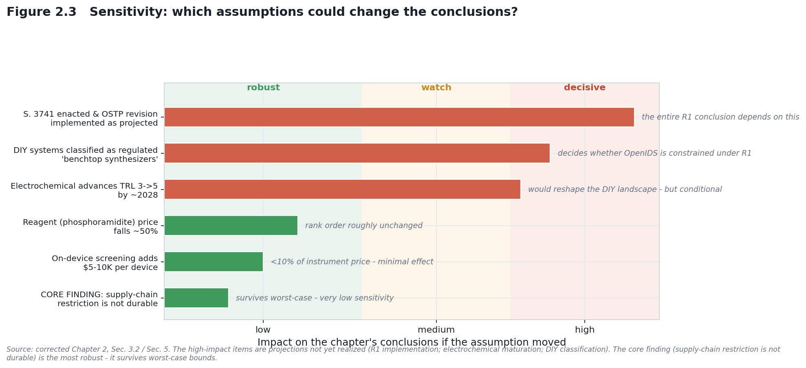
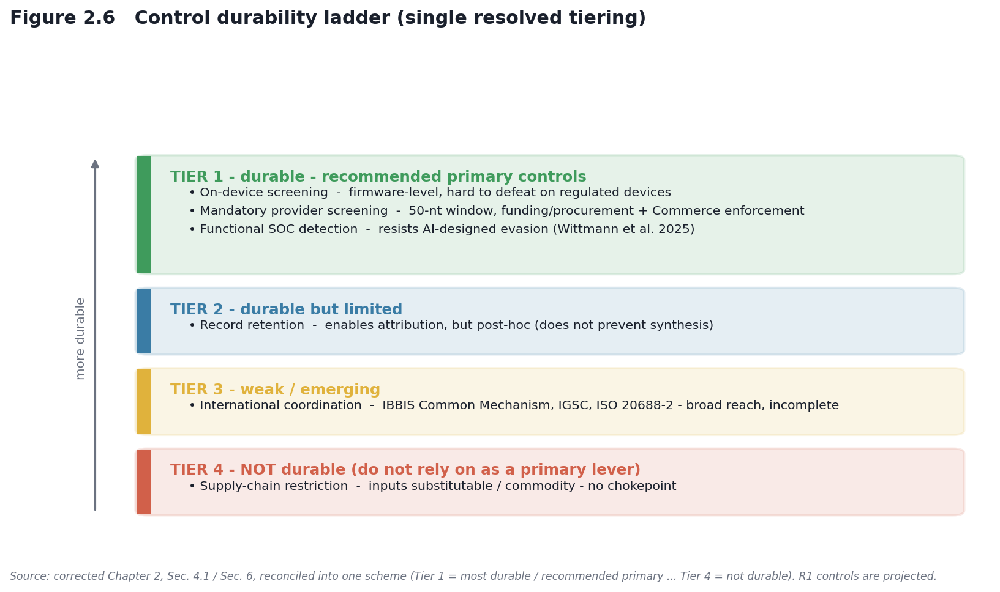

# CHAPTER 2: REGIME-CONDITIONAL CONTROL ASSESSMENT

## Synthesis Screening Under Device Proliferation — Control-Point Robustness and Policy Durability

*Draft — corrected July 2026*

**Scope:** Synthesis-level control mechanisms under R0 (status quo) and R1 (projected mandatory / on-device) regimes.
**Methodology:** Substitution tests, sensitivity analysis, scenario modeling, control-architecture assessment.

---

## EXECUTIVE SUMMARY

This chapter assesses the durability of synthesis-screening and governance mechanisms across two regimes:

- **R0 (status quo, October 2026):** voluntary screening; no enforced federal mandate; weak enforcement.
- **R1 (projected, late 2026+):** a *composite projection* — the OSTP framework's technical screening spec (mandatory 50-nt window, functional SOC definitions, on-device/manufacturer expectations) given legal force by S. 3741 (Commerce regulation) and/or federal funding conditions. Under R1 the control question shifts: with commercial providers and benchtop manufacturers inside the screening perimeter, the residual exposure is **DIY / in-house synthesis** reached by neither a provider nor a device mandate — the control gap this chapter tracks.

**Key finding.** R0 control architecture is fragile across all levers (supply-chain, provider-level, voluntary screening). If implemented, R1 is substantially more robust at device-level screening and mandatory provider compliance, but retains residual vulnerabilities — chiefly reagent/solvent substitutability, ambiguous status of DIY systems, legacy devices, and extra-jurisdictional providers.

**Policy implication.** S. 3741 and the (paused) OSTP framework revision together would create more durable control than supply-chain restriction can achieve — but supply-chain restriction should not be a primary lever, because key inputs are substitutable or commodity.

---

## 1. REGIME R0 CONTROL ARCHITECTURE (OCTOBER 2026 STATUS QUO)

### 1.1 R0 Policy Baseline

The OSTP Framework for Nucleic Acid Synthesis Screening (April 2024) was issued under **EO 14110** (§4.4(b)(i), Oct 30, 2023). Its funding requirement took effect for federally funded purchases on or after **April 26, 2025** (NIH NOT-OD-25-012). **EO 14292** (*Improving the Safety and Security of Biological Research*, May 5, 2025) then directed federal agencies to **revise or replace** the framework within 90 days (deadline Aug 3, 2025); as of July 2026 no revised framework has been published, leaving the framework's enforcement status uncertain. The **IGSC Harmonized Screening Protocol v3.0** (September 2024) operates voluntarily. No mandatory on-device screening requirement is in force for benchtop manufacturers, and no bulk-reagent monitoring exists.

**Governing documents (R0):**
- OSTP Framework for Nucleic Acid Synthesis Screening (April 2024) — funding requirement effective April 26, 2025; paused/under revision per EO 14292.
- IGSC Harmonized Screening Protocol v3.0 (September 2024) — voluntary.
- HHS Screening Framework Guidance for Providers and Users of Synthetic Nucleic Acids (October 2023) — recommendations.
- NIH NOT-OD-25-012 — procurement condition (federally funded purchasers only).

### 1.2 R0 Control Levers (4)

**Lever 1: Provider-level screening (IGSC members).** IGSC v3.0 has members screen orders against a Regulated Pathogen Database (RPD; managed in a public GitHub repository). The historical minimum was a **200-nucleotide** window; **IGSC v3.0 requires members to transition to a 50-bp threshold by October 24, 2026** to conform to the OSTP framework. Members (e.g., Twist Bioscience, IDT, GenScript, Eurofins, DNA Script, Ansa) adopt this voluntarily.
**R0 durability: LOW.** Non-members are unbound; implementation varies across members (a provider survey found only some members using 200 nt as their floor, others screening everything or at 20–60 nt); orders can be routed to providers outside IGSC entirely. No federal mechanism compels participation.

**Lever 2: Printhead sourcing (supply-chain chokepoint).** Industrial inkjet printheads (multiple suppliers, several countries) are standard components with many non-synthesis uses (textile, ceramic, 3D printing).
**R0 durability: VERY LOW.** No geographic or legal chokepoint; commodity cost; no export-control or licensing regime; non-synthesis demand precludes synthesis-specific monitoring.

**Lever 3: Phosphoramidite supply (reagent chokepoint).** Standard phosphoramidites are commodity research chemicals from multiple independent suppliers globally (Glen Research, ChemGenes, LGC Biosearch, Sigma/Millipore).
**R0 durability: VERY LOW.** No single chokepoint; competitive unregulated market; alternative chemistries (enzymatic, electrochemical) reduce dependence.

**Lever 4: Solvent supply (acetonitrile → propylene carbonate).** Kim et al. (2024) demonstrate OpenIDS operating with propylene carbonate — a GRAS food additive — as a substitute for acetonitrile.
**R0 durability: VERY LOW.** Propylene carbonate is an unregulated global commodity; other aprotic-solvent substitutes exist.

### 1.3 R0 Residual Vulnerabilities (by approach — analytical)

*Stated as the governance-relevant vulnerability, not as procedures.*

- **OpenIDS (inkjet):** physically visible but subject to no R0 registration or monitoring; IGSC screening reaches only orders placed with participating providers, so a DIY device outside that channel falls outside every R0 lever. Detectability (R0): **Low.**
- **MAS 2.0 (photolithographic):** an open-source maskless array synthesizer; a visible bench build but outside any R0 registration, and self-run library-grade output is not synthesis-screened. Same DIY blind spot as OpenIDS. Detectability (R0): **Low.**
- **Electrochemical:** at TRL 3 and resembling generic electrochemistry apparatus, presents no distinctive equipment/procurement signature. Detectability (R0): **Very Low** — but this is a conditional-future concern (immature; no independent builds).
- **Enzymatic (service):** constrained at the provider. Major providers (Ansa, DNA Script) screen voluntarily; no significant unscreened enzymatic-service market identified as of July 2026. Residual: extra-jurisdictional providers. Detectability (R0): **Low–Medium.**
- **Enzymatic (benchtop):** unmonitored after purchase under R0 (no on-device mandate); private synthesis leaves no external trace. Detectability (R0): **Very Low.**
- **DropSynth:** an *assembly* method (vortex emulsion; no microfluidic fabrication, no cleanroom) that stitches a **commercial microarray oligo pool** into genes — so it **inherits the screening perimeter** through its provider-supplied inputs. Barrier is molecular-biology expertise, not equipment. Detectability (R0): **Low–Medium** (inputs are provider-screenable; assembly itself is untracked).
- **Commercial benchtop:** manufacturer/reseller customer vetting is voluntary and uneven under R0; no on-device detection. Detectability (R0): **Low–Medium.**

### 1.4 R0 Summary: fragile across all levers

| Control lever | Mechanism | Enforcer | Durability | Why it fails |
|---|---|---|---|---|
| Provider screening | IGSC v3.0 (voluntary) | Self-regulatory | LOW | Non-members / other providers outside protocol |
| Printhead sourcing | Availability monitoring | None | VERY LOW | Many suppliers; non-synthesis uses; no oversight |
| Phosphoramidite supply | Reagent restriction | None | VERY LOW | Multiple global suppliers; no chokepoint |
| Solvent (acetonitrile) | Solvent restriction | EPA (hazmat only) | VERY LOW | GRAS substitute (propylene carbonate) available |

**Conclusion.** No single R0 lever is durable; restricting one input allows substitution of another. Supply-chain restriction is not a durable control mechanism under R0.

---

## 2. REGIME R1 CONTROL ARCHITECTURE (LATE 2026+, PROJECTED)

### 2.1 R1 Policy Baseline

R1 is a **projected** regime assembled from **two distinct instruments that must be kept separate** (their conflation was an error in earlier drafts):

**(A) The OSTP Framework revision — the technical screening specification.**
The framework is where the screening *mechanics* live. Its scheduled tightening — a **200 → 50-nucleotide** window and an **expanded, functional SOC** definition (sequences that contribute to pathogenicity/toxicity, *including* those from unregulated agents) — is dated **October 13, 2026** (three years after the October 2023 HHS Guidance), with IGSC members required to align by **October 24, 2026** (IGSC v3.0). **The framework's enforcement is via funding/procurement conditions:** federal funding agencies require federally funded purchasers to buy only from providers/manufacturers adhering to the framework (NIH NOT-OD-25-012; parallel DOE Financial Assistance Letter). EO 14292 (May 5, 2025) paused the framework and directed revision within 90 days (deadline Aug 3, 2025); **as of July 2026 no revised framework is published**, so the October 2026 milestone is documented but its on-schedule effect is uncertain.

**(B) S. 3741, the *Biosecurity Modernization and Innovation Act of 2026* — the legislative vehicle.**
Introduced January 29, 2026 (Cotton, Klobuchar; referred to Senate Commerce). What it *actually* does: directs the **Secretary of Commerce** to promulgate regulations requiring gene-synthesis providers to screen **orders and customers**; establishes a **biotechnology governance sandbox at NIST**; requires a 90-day White House assessment of federal biosecurity oversight. Its enforcement vehicle is **Commerce regulation** — *not* funding/procurement conditions and *not* FDA device regulation — and the bill does **not** itself specify the 50-nt window, functional-SOC definitions, or an on-device manufacturer mandate. Those are OSTP-framework specifics.

**Enforcement mechanisms — three distinct pathways (corrected):**
1. **Funding/procurement conditions** (the OSTP framework's mechanism): reaches federally funded purchasers only, via award terms (NIH NOT-OD-25-012; HHS/ASPR; DOE FAL). Covers providers *and* benchtop manufacturers, but not non-federally-funded actors.
2. **Commerce regulation** (S. 3741's mechanism, if enacted): would make provider order/customer screening mandatory more broadly than funding conditions reach.
3. **FDA device classification** is *not* the mechanism and remains **unresolved** — whether DIY/benchtop synthesizers acquire a formal device classification, and under whose authority, is an open question, not an established mandate.

**Composite R1, stated honestly.** The "mandatory + on-device" R1 this chapter models = the OSTP framework's technical spec (50-nt, functional SOC, manufacturer/on-device expectations) **+** a screening mandate given force by S. 3741 (Commerce) and/or the framework's funding conditions. As of July 2026, the framework is paused and S. 3741 is a referred bill. Every R1 claim is conditional on the framework revision being issued substantially as scheduled *and* on S. 3741 (or equivalent) being enacted.

### 2.2 R1 Control Levers (5)

**Lever 1: Mandatory provider screening (50-nt threshold).** Under R1, provider order/customer screening becomes mandatory — via Commerce regulation (S. 3741) and/or funding/procurement conditions — at a **50-nucleotide window** (vs. R0's voluntary 200-nt), against the regulated-pathogen database plus functional SOC definitions. Screening compares each ordered sequence — in nucleotide space and across six-frame protein translations — against regulated-agent sequences; a best match within a defined window (each **16 amino acid and/or 50 nucleotide** window) flags the order for customer-legitimacy review.
**R1 durability: MEDIUM–HIGH.** Mandatory compliance for covered providers; functional definitions improve detection of AI-designed variants. Residual gap: providers outside U.S. jurisdiction. **Benchmarking:** Laird et al. (*Applied Biosafety*, 2025) found tested screening tools cleared **>95% sensitivity and >97% accuracy** on a blinded NIST dataset, with most already screening to 50 nt and several implementing functional checks.

**Lever 2: On-device screening (manufacturers).** The OSTP framework directs manufacturers of benchtop equipment to screen SOC-containing runs and retain flagged-order records; under R1 this is enforced through **funding/procurement conditions** on federally funded purchasers of benchtop equipment (NOT-OD-25-012). A broader statutory on-device mandate would require the framework revision or new legislation — S. 3741 as introduced does not add one.
**R1 durability: MEDIUM–HIGH.** Hard to circumvent on compliant commercial devices; applies to newly manufactured units. Residual gaps: legacy/used devices without screening; the unresolved status of DIY/open-source systems (see §2.1). Cost context: IFP (2024) treats screening integration as a modest fraction of instrument cost.

**Lever 3: Functional SOC detection (AI-resistant).** Shifts detection from pure sequence homology toward function-aware definitions (six-frame translation + functional annotation, structural/regulatory features, detection of AI-designed variants).
**R1 durability: MEDIUM–HIGH.** Harder to evade than synonymous-codon changes. **Motivation:** Wittmann et al. (2025) showed AI-designed proteins can evade similarity-based screening (one tool pre-patch flagged only 23% of variants); the response — patches raising detection to ~72% average and 97% of the most-likely-functional variants — drove *improved* (functional) detection, not screening obsolescence.

**Lever 4: Mandatory record retention (forensic trail).** Providers retain customer/order/screening/disposition records (≥3 years; longer where feasible).
**R1 durability: MEDIUM.** Enables post-hoc attribution and deters repeat activity, but is post-incident (does not prevent initial synthesis); extra-jurisdictional providers are unbound.

**Lever 5: International coordination.** The **IBBIS Common Mechanism** provides a free, global baseline screening tool; **IGSC** (40+ members) applies the Harmonized Screening Protocol and maintains the RPD in a public GitHub repository; **ISO 20688-2:2024** carries biosecurity provisions; the **Australia Group** coordinates export controls across ~43 countries; and the BWC Ninth Review Conference (2022) established a follow-on working group on measures including nucleic-acid synthesis. UK DSIT (Oct 2024) and EU guidance overlap but are not identical to U.S. guidance.
**R1 durability: LOW–MEDIUM.** Coordination is incomplete; non-participating jurisdictions remain outside the regime, though major global providers tend to comply with the strictest applicable regime. (A U.S.-only mandate would shift orders to unscreened foreign providers — the chokepoint fails without international agreement.)

### 2.3 R1 Residual Vulnerabilities (by approach — analytical)

- **OpenIDS:** if DIY open-source tools fall under a device mandate, on-device screening applies (though open firmware is a weaker barrier than proprietary firmware — §3.1); if exempted, only provider-level screening reaches it. Classification unresolved. Detectability (R1): **Low–Medium.**
- **MAS 2.0:** shares OpenIDS's unresolved DIY classification — on-device screening applies only if open-source array synthesizers are brought under a device mandate; otherwise only provider-level screening of any purchased reagents/oligos reaches it. Detectability (R1): **Low–Medium.**
- **Electrochemical:** likely outside any on-device mandate (not a commercial device) and hard to detect; a policy gap in the projected framework. Detectability (R1): **Low.**
- **Enzymatic (service):** strengthened — mandatory provider screening, enforcement, tighter window, retention. Residual: extra-jurisdictional providers. Detectability (R1): **High** domestically; **Low** internationally.
- **Enzymatic (benchtop):** constrained by manufacturer on-device expectations + retention. Residual: legacy devices. Detectability (R1): **Medium–High.**
- **DropSynth:** provider screening reaches its commercial oligo-pool inputs (the assembly inherits the perimeter); an expertise barrier, not an equipment one; a device mandate would apply only if it were ever commercialized as an instrument. Detectability (R1): **Medium.**
- **Commercial benchtop:** most constrained — on-device screening + mandatory provider screening + retention + funding/procurement enforcement. Residual: secondary market for legacy devices. Detectability (R1): **High** (new); **Medium** (legacy).

---

## 3. CONTROL-ROBUSTNESS ANALYSIS

### 3.1 Substitution test: if one lever fails, do others hold?

- **Provider screening circumvented** (order routed to a non-participating or extra-jurisdictional provider). R0: control fails. R1: on-device screening backstops compliant devices → holds; DIY/unregulated-service routes → fails. **Finding:** on-device screening is the effective backstop, but only where it applies.
- **On-device screening on DIY vs. commercial devices.** Open-source firmware is inherently modifiable, so on-device screening is not tamper-proof for DIY systems; proprietary commercial firmware is a substantially higher barrier. Record retention gives a partial post-hoc backstop in both cases. **Finding:** on-device screening is durable for regulated commercial devices, weak for open DIY systems — an argument for pairing it with provider-level and attribution controls, *not* a circumvention recipe.
- **Phosphoramidite restriction.** Fails under both regimes: multiple suppliers, propylene-carbonate substitution commodity-trivial. **Finding:** reagent restriction is not durable.
- **Printhead restriction.** Fails: many suppliers, non-synthesis cover demand, non-printhead methods sidestep it. **Finding:** component restriction is not durable.

### 3.2 Sensitivity analysis

- **Reagent price −50%.** Rank order roughly unchanged: commercial remains cheapest per base; OpenIDS remains accessible at ~$1–2/seq; service pricing sticky. No material shift.
- **On-device screening cost +$5–10K/device.** <10% of instrument price for commercial/enzymatic benchtop; minimal adoption impact; DIY unaffected. No material shift.
- **Electrochemical TRL 3→5 by 2028 (conditional).** If it occurred, electrochemical could become the cheapest DIY option (~$8–10K), displacing OpenIDS as sole low-cost DIY route. But advancement is conditional-future and not guaranteed.

### 3.3 Scenario test: full R1 mandate implemented

Assuming S. 3741 is enacted and the OSTP revision implements on-device + mandatory provider screening with functional SOC detection and retention:

| Approach | Provider screening | On-device | Functional detection | Retention | Overall R1 detectability |
|---|---|---|---|---|---|
| OpenIDS | bypassable via non-participating provider | applies iff classified (open firmware weak) | active | provider-side | Medium (if classified) / Low (if exempt) |
| MAS 2.0 | bypassable (self-run) | applies iff classified | active | provider-side | Medium (if classified) / Low (if exempt) |
| Electrochemical | bypassable | does not apply (not commercial device) | active | partial | Low (policy gap) |
| Enzymatic (service) | mandatory (strengthened) | n/a | strengthened | mandatory | Medium–High (intl gap) |
| Enzymatic (benchtop) | mandatory | manufacturer-integrated | active | device + provider | Medium–High (legacy gap) |
| Commercial benchtop | mandatory | manufacturer-integrated | active | device + provider | High (new) / Medium (legacy) |
| DropSynth | applies to oligo-pool inputs | iff commercialized | active | provider-side | Medium (inherits perimeter via inputs) |

**Scenario summary.** Heavily constrained: commercial benchtop, enzymatic benchtop, enzymatic service (domestic). Moderately constrained: OpenIDS and MAS 2.0 (if classified), DropSynth (inputs screened). Weakly constrained: electrochemical, OpenIDS/MAS 2.0 (if exempt), extra-jurisdictional service.

**Residual vulnerabilities (R1):** (1) legacy/used devices without on-device screening; (2) unresolved DIY classification; (3) extra-jurisdictional providers; (4) reagent/solvent substitutability.

---

## 4. CONTROL SURVIVAL MATRIX (worst-case)

| Control lever | R0 survives worst case? | R1 survives worst case? | Note |
|---|---|---|---|
| Provider screening | ✗ | ✗ (gap: extra-jurisdictional) | Mandatory helps domestically; international gap remains |
| Phosphoramidite supply | ✗ | ✗ | Multiple suppliers; no chokepoint |
| Acetonitrile solvent | ✗ | ✗ | GRAS substitute (propylene carbonate) |
| Printhead sourcing | ✗ | ✗ | Cover demand; alternative methods exist |
| On-device screening | N/A | ◑ partial (new devices; weak for DIY/legacy) | Effective for regulated commercial devices |
| Functional SOC detection | ✗ (R0 = homology only) | ✓ (harder, not impossible) | Motivated by Wittmann et al. 2025 |
| Record retention | N/A | ✓ (post-hoc only) | Attribution, not prevention |
| International coordination | ✗ | ◑ partial | Non-signatories remain outside |

### 4.1 Robustness ranking

| Mechanism | R0 | R1 | Durability tier |
|---|---|---|---|
| Provider screening (domestic) | LOW | MED–HIGH | Tier 1 (enforcement-dependent) |
| On-device screening (new devices) | N/A | MED–HIGH | Tier 1 (weak for DIY/legacy) |
| Functional SOC detection | N/A | MEDIUM | Tier 1 |
| Record retention | N/A | MEDIUM | Tier 2 (post-hoc) |
| International coordination | N/A | LOW–MED | Tier 3 |
| Supply-chain restriction | VERY LOW | VERY LOW | Tier 4 (not durable) |

---

## 5. KEY FINDINGS & POLICY IMPLICATIONS

1. **R0 is fragile across all levers.** Voluntary governance + fragmented supply-chain monitoring is insufficient; supply-chain restriction offers negligible resistance. → Do not rely on supply-chain restriction as a primary lever.
2. **R1 on-device screening is more durable than supply-chain restriction — if implemented** — but retains gaps for DIY systems, legacy devices, and extra-jurisdictional providers. → Pair device-level control with provider-level screening and attribution.
3. **Substitution resistance persists at the reagent/solvent level under both regimes.** → Control belongs at the device and provider, not the input.
4. **Electrochemical synthesis is underspecified in the projected framework** (portable, low-signature, unclear device status). → The framework revision should address classification and oversight explicitly.
5. **Enzymatic service becomes more controllable under R1** (mandatory provider screening, enforcement, centralized auditability). → Shifting demand toward regulated providers strengthens governance.

---

## 6. RECOMMENDED CONTROL ARCHITECTURE (R1 + post-2026)

**Tier 1 (high durability):** mandatory on-device screening for benchtop devices; mandatory provider screening (50-nt, functional SOC) enforced via Commerce regulation and/or funding/procurement; functional SOC detection integrated with structural/functional resources.
**Tier 2 (medium durability):** mandatory record retention (attribution).
**Tier 3 (emerging):** international coordination (IBBIS Common Mechanism; IGSC; ISO 20688-2; UK/EU alignment).
**Not recommended as a primary control (Tier 4, low durability):** supply-chain restriction on phosphoramidites, solvents, or printheads — substitutable/commodity, with non-synthesis cover demand.

---

## 7. CRITICAL POLICY GAPS

1. **DIY-systems classification (OpenIDS, electrochemical).** Unresolved whether open-source/DIY tools fall under a device mandate. → Define scope explicitly or establish an alternative oversight pathway.
2. **Electrochemical underspecified.** → Address emerging low-signature platforms in the framework.
3. **Legacy/secondary-market devices.** Pre-mandate instruments lack on-device screening. → Consider registration/retrofit.
4. **Incomplete international coordination.** → Pursue bilateral/multilateral alignment with major supply-chain jurisdictions.

---

## 8. CONCLUSION

R0 voluntary provider screening plus fragmented supply-chain monitoring is not a durable control architecture: every lever can be circumvented through substitution or routing around participating providers, and supply-chain restriction lacks durability.

R1, *if implemented as projected and paired with the complementary measures above*, would be substantially more durable — mandatory on-device + provider screening + functional detection + retention create multiple layers hard to defeat simultaneously for regulated devices. But R1 remains incomplete without resolving four gaps: DIY classification, electrochemical oversight, legacy devices, and international coordination.

**Honest bottom line, split by confidence:**
- **HIGH confidence:** supply-chain restriction is not a durable control (structural; survives worst-case).
- **Conditional/MEDIUM confidence:** R1 device-level control will prove effective — this depends on the OSTP framework revision being issued and S. 3741 (or equivalent) being enacted and implemented, and on resolving the DIY-classification question. The chapter does not claim R1 *works*; it claims R1 is *aimed at the right levers*.

---

## REFERENCES

**Policy documents**
- Executive Order 14292 (2025). *Improving the Safety and Security of Biological Research.* Federal Register, 90 FR 19611 (May 8, 2025).
- Executive Order 14110 (2023). *Safe, Secure, and Trustworthy Development and Use of Artificial Intelligence* (§4.4(b)). October 30, 2023 (rescinded Jan 25, 2025).
- OSTP (2024). *Framework for Nucleic Acid Synthesis Screening.* ASPR S3. https://aspr.hhs.gov/S3/Documents/OSTP-Nucleic-Acid-Synthesis-Screening-Framework-508.pdf
- U.S. Congress (2026). S. 3741, *Biosecurity Modernization and Innovation Act of 2026*, 119th Congress (Cotton, Klobuchar). https://www.congress.gov/bill/119th-congress/senate-bill/3741
- HHS/ASPR (2023). *Screening Framework Guidance for Providers and Users of Synthetic Nucleic Acids.* October 2023.
- NIH NOT-OD-25-012 (2024). *Notification of NIH Requirements Regarding Procurement of Synthetic Nucleic Acids and Benchtop Nucleic Acid Synthesis Equipment* (effective April 26, 2025).
- IGSC (2024). *Harmonized Screening Protocol v3.0.* https://genesynthesisconsortium.org/ (50-bp transition by October 24, 2026).
- UK Government, DSIT (2024). *Guidance on screening synthetic nucleic acids.*
- ISO 20688-2:2024, *Biotechnology — Nucleic acid synthesis* (biosecurity provisions).

**Scientific literature**
- Kim, J., Kim, H., & Bang, D. (2024). An open-source, 3D printed inkjet DNA synthesizer. *Scientific Reports*, 14, 3773. https://doi.org/10.1038/s41598-024-53944-x
- Wittmann, B. J., Alexanian, T., Bartling, C., et al. (2025). Strengthening nucleic acid biosecurity screening against generative protein design tools. *Science*, 390(6768), 82–87. https://doi.org/10.1126/science.adu8578
- Laird, T. S., et al. (2025). Inter-tool Analysis of a NIST Dataset for Assessing Baseline Nucleic Acid Sequence Screening. *Applied Biosafety*. https://doi.org/10.1177/15356760251401228

**Grey literature**
- Institute for Progress (2024). *Securing Benchtop DNA Synthesizers.* https://ifp.org/securing-benchtop-dna-synthesizers/
- Nuclear Threat Initiative (NTI | bio). Reports on benchtop DNA synthesis governance. https://www.nti.org/
