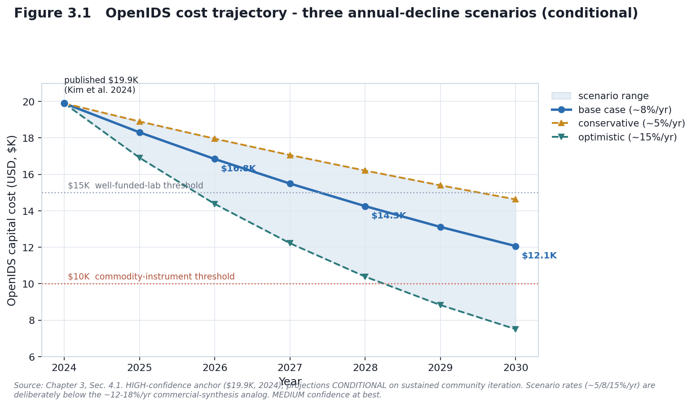
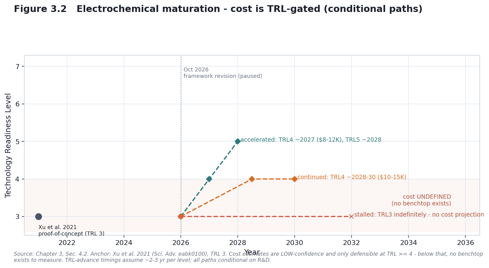
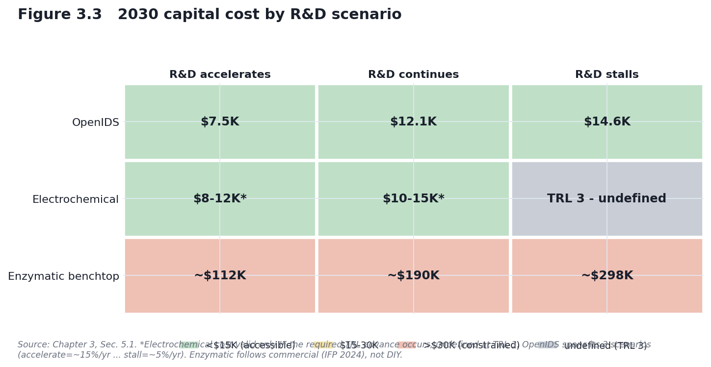

# CHAPTER 3: COST & ACCESSIBILITY TRAJECTORIES

## Predictive Cost Modeling with Explicit Uncertainty and Conditional Language

*Draft — corrected July 2026*

**Scope:** Learning-curve modeling of DIY/benchtop synthesis accessibility (OpenIDS/OpenIDS2, MAS 2.0, electrochemical, enzymatic, and DropSynth assembly) to 2030. Curve-fitting is applied only where a real cost anchor exists (OpenIDS); the other routes are placed as present-day cost points with explicit caveats.
**Method:** Experience-curve reasoning by analogy (DNA sequencing; commercial synthesis cost-per-base), expressed as **scenario annual-decline rates** with confidence bands and TRL gating; scenario sensitivity analysis.

**Two framing notes that govern the whole chapter.**

1. **Scenario rates, not mechanical fits.** We express projections as *assumed annual cost-decline rates* (e.g., ~5% / ~8% / ~15%), informed by analog learning rates but not mechanically derived from Wright's law. Converting a Wright's-law exponent *b* (an elasticity with respect to cumulative production) into a per-year rate requires an assumption about how fast cumulative build volume doubles — and DIY build volumes are unknown. We therefore do not claim a Wright's-law fit for DIY synthesis; we use annual-decline scenarios and say so.
2. **TRL gate.** Cost projections are only meaningful for approaches that actually work at benchtop scale. For TRL ≤ 3 technologies (electrochemical), cost is undefined and we model maturation first, cost second and only conditionally.

---

## EXECUTIVE SUMMARY

This chapter develops cost/accessibility forecasts for DIY and benchtop synthesis through 2030, using sequencing and commercial-synthesis cost histories as analogs. No point estimates are given; all forecasts are ranges with conditional language.

**Key findings:**
1. **OpenIDS (HIGH-confidence anchor, MEDIUM projection):** $19.9K (2024) → ~$16.8K (2026, base) → ~$12.1K (2030, base) if community iteration continues. Crosses <$15K around **2027** (base; 2026 optimistic, 2029–2030 conservative); <$10K is a **~2028 optimistic / ~2032 base** prospect — not a base-case-2020s certainty.
2. **Electrochemical (LOW confidence, TRL-gated):** cost is undefined at the current TRL 3; projections become meaningful only if/when it reaches TRL 4 (~2028–2030, uncertain).
3. **Enzymatic benchtop:** commercial-only; ~$200–292K now (DNA Script STX-200, IFP 2024; vendor quote €250–280K), and the Institute for Progress report (Langenkamp, 2024) compiles a 2030 forecast for a 5-kb-capable benchtop with a distribution **peaking near ~$190K** (25th–75th-percentile ~$112–298K, 2024 USD; the distribution reflects a community/expert forecast cited in that report, not a first-party engineering cost model). No credible DIY pathway by 2030.
4. **Scenarios:** an R&D stall delays electrochemical TRL advance by ~2–3 years; acceleration could reach TRL 4 by ~2027.

**Central caveat:** these learning curves come from technologies with large competitive markets (sequencing) that DIY synthesis lacks. All projections are conditional on sustained R&D and interest; read them as "if current trajectories persist," not "will."

---

## 1. METHOD: LEARNING CURVES AND THEIR LIMITS

Experience curves (Wright, 1936) describe cost falling with cumulative production: Cost = C₀ · Q^(−b), where Q is cumulative volume and b is the learning elasticity. As noted above, we use b only to characterize the analogs; our DIY projections are stated as annual-decline scenarios because DIY cumulative volume is unknown.

**Why by analogy, and why cautiously.** Learning curves are the standard tool for technology-cost forecasting, but model choice and transfer are genuinely uncertain. Nagy, Farmer, Bui & Trancik (2013), testing six forecasting models across 62 technologies, found that Wright's law forecasts best but only marginally better than Moore's law — the two are nearly indistinguishable because cumulative production tends to grow exponentially — and that forecast error grows with horizon (root-mean-square logarithmic error increasing at a typical rate of ~2.5% per year of horizon). Lafond et al. (2018) develop distributional forecasts and show experience-curve error increases substantially as the horizon lengthens. We therefore (a) transfer analog rates only as bounded scenarios, (b) never give single-year point forecasts, and (c) TRL-gate approaches that don't yet work.

*(Note: 3D printing is sometimes cited as a third analog. We do not use it as a data series — a clean primary price index is not readily available — and treat it, at most, as a qualitative illustration of how a maturing technology's cost can fall.)*

---

## 2. ANALOG CURVES: DATA AND TRANSFER LOGIC

### 2.1 DNA sequencing cost (NHGRI, 2001–2022)

Source: Wetterstrand, *DNA Sequencing Costs: Data from the NHGRI Genome Sequencing Program*, genome.gov/sequencingcostsdata (quarterly, Sept 2001–May 2022; NHGRI ceased updates in 2022).

Milestone cost per genome (approximate; use for curve shape only):

| Year | Cost per genome (approx.) | Note |
|---|---|---|
| 2001 (Sept) | ~$95M | start of NHGRI tracking (Sanger) |
| 2007 | ~$10M | pre-NGS |
| 2008 (Oct) | ~$0.75M | next-gen inflection |
| 2010 | ~$50K | NGS platforms maturing |
| 2015 | ~$4K | approaching the "$1,000 genome" era |
| 2022 (last update) | few-hundred to ~$1K | plateau |

**Learning rate (NGS era, ~2008–2015):** cost roughly halved every ~1.5–2 years (~30–40% per year) in the steepest phase — far faster than Moore's law. Post-2015 the decline slowed markedly; further drops depend on new platform innovation (Carlson; synthesis.cc).

**Why sequencing is only a shape analog, not a rate to transfer directly:**
- Sequencing was pulled by a large clinical/research market driving volume; DIY synthesis has no comparable end-market.
- Sequencing saw platform competition (454 / Illumina / SOLiD) accelerating innovation; commercial synthesis supply is comparatively consolidated.
- NGS cost fell largely through capital/instrument amortization; synthesis cost is now dominated by materials and labor, which plateau.
- (We do *not* claim sequencing and synthesis share phosphoramidite chemistry — modern sequencing does not use it. The valid transfer caveats are market and competition structure.)

**Implication:** treat sequencing's ~30–40%/yr as an optimistic upper bound only; expect real DIY declines at the low end (single-digit to low-teens % per year) absent a market driver.

### 2.2 Commercial synthesis cost-per-base (synthesis.cc)

Source: Carlson / Field, DNA synthesis & sequencing cost tracking, synthesis.cc. *Verify exact figures at source before quoting a precise number.*

| Year | Cost/base (approx.) | Note |
|---|---|---|
| ~2000s | tens of dollars → ~$1 | column synthesis |
| 2010 | ~$0.30–0.50 | array synthesis emerging |
| 2015 | ~$0.10–0.20 | vendor competition (Twist, GenScript) |
| 2020–2025 | ~$0.07–0.10 (plateau) | enzymatic entering as service; column service price ~$0.30/bp |

**Why the plateau** (Carlson, 2009; 2014): as oligo/gene synthesis matured, capital and labor came to dominate materials cost, and few new commercial synthesizer platforms have launched, so prices stopped falling steeply.

**Implication for DIY:** commercial cost-per-base has plateaued (~$0.07/bp), and DIY per-base cost at small batch sizes is likely to remain several-fold higher. **The DIY accessibility barrier is therefore capital cost (the ~$20K instrument), not per-base cost.**

### 2.3 Benchtop synthesizer projection (IFP, 2024)

Source: Institute for Progress (2024), *Securing Benchtop DNA Synthesizers*.

IFP's probabilistic model for a 5-kb-capable benchtop in 2030: the predicted cost distribution **peaks near ~$190K** (2024 USD; this is the density peak/most-probable value, *not* the median), with a 25th–75th-percentile range of ~$112K–$298K, assuming incremental improvement and no breakthrough. This is an independent comparator for the commercial (non-DIY) trajectory; it is a projection, not historical data.

---

## 3. FROM ANALOGS TO SCENARIOS

### 3.1 Analog learning rates (characterization only)

| Domain | Period | Halving time | Annual decline | Notes |
|---|---|---|---|---|
| Sequencing (NGS) | ~2008–2015 | ~1.5–2 yr | ~30–40%/yr | large market + platform competition |
| Synthesis cost/base | ~2003–2015 | ~4–6 yr | ~12–18%/yr | slowed sharply after ~2015 |
| Benchtop (IFP proj.) | 2024–2030 | — | ~3–5%/yr | projection, not historical |

*(These describe the analogs. They are not applied mechanically to DIY; §3.2 converts them into bounded annual-decline scenarios.)*

### 3.2 DIY scenarios: borrow-and-hedge

For OpenIDS (the only real DIY system with a cost anchor), we define three annual-decline scenarios, **informed by but deliberately more conservative than the commercial-synthesis analog (~12–18%/yr)** — because DIY lacks the market drivers that produced those declines. The base case (~8%/yr) sits well below the commercial analog; even the optimistic case (~15%/yr) only reaches the low end of it.

| Approach | Conservative | Base case | Optimistic |
|---|---|---|---|
| OpenIDS | ~5%/yr | ~8%/yr | ~15%/yr |
| Electrochemical | *not applicable — TRL 3 (cost undefined)* | | |
| Enzymatic benchtop | IFP pessimistic | IFP peak | IFP optimistic |

*Rationale: OpenIDS has a 2024 anchor ($19.9K); electrochemical has no benchtop system, so any cost curve would be false precision.*

> **Correction note (this draft):** the previous draft labeled these scenarios "8% / 15% / 25%/yr", but the cost values actually tabulated and plotted decline at ~5% / ~8% / ~15%/yr. The rate labels have been corrected to match the values (which are the more defensible set — they sit below the commercial analog, consistent with the "DIY lacks market drivers" argument). The headline forecast is correspondingly more conservative: base case reaches <$10K around 2032, not 2028–2029.

---

## 4. COST PROJECTIONS (2024–2030)

### 4.1 OpenIDS (HIGH anchor, MEDIUM projection)

**Anchor:** Kim, Kim & Bang (2024) built OpenIDS for $19,900. A 2025 successor, **OpenIDS2** (Kim, Kim & Bang, 2025, *PLOS ONE*), is a smaller, more reproducible design described as lower-cost, but it publishes only component-level figures and no itemized total — so the **$19,900 build remains the only citable capital anchor**, and the successor is treated as directional support for the downward trajectory rather than a second data point.

Projection (annual-decline scenarios, computed from the $19.9K anchor):

| Year | Conservative (~5%/yr) | Base (~8%/yr) | Optimistic (~15%/yr) |
|---|---|---|---|
| 2024 | $19.9K | $19.9K | $19.9K |
| 2026 | $18.0K | $16.8K | $14.4K |
| 2028 | $16.2K | $14.3K | $10.4K |
| 2030 | $14.6K | $12.1K | $7.5K |

**Interpretation:**
- Base case: <$15K by ~2027; ~$12K by 2030.
- Conditional on sustained community iteration, stable supply, and continued interest.
- Reference points: <$15K ≈ a used lab HPLC; <$10K ≈ a modern benchtop PCR machine.

**Quality caveat:** these are capital-cost projections and say nothing about synthesis quality (error rate, length). Quality bottlenecks could require R&D and slow cost decline.

### 4.2 Electrochemical (LOW confidence, TRL-gated)

**Anchor:** Xu et al. (2021, *Science Advances* 7(46):eabk0100) — proof-of-concept (phosphoramidite chemistry with electrochemical deprotection). Chapter 1 TRI: TRL 3. No independent replication and no DIY/benchtop instrument documented as of July 2026.

**Maturation pathway (conditional):**

| TRL | Milestone | Timeline | Confidence |
|---|---|---|---|
| 3 (now) | proof-of-concept (single paper) | 2021–2026 | HIGH |
| 4 | independent benchtop replication | 2027–2029 if R&D continues | MEDIUM |
| 5 | DIY/benchtop prototype by non-authors | 2028–2030 if TRL 4 reached | LOW |
| 6–7 | robust/commercial system | 2030+ | VERY LOW |

**Cost: undefined at TRL 3.** If the technology reaches TRL 4 (~2028–2030), a single LOW-confidence range of roughly $8–15K is plausible — but we deliberately give no component breakdown, because itemizing parts for a system that does not yet exist is false precision. The honest statement: no benchtop exists to measure, so any figure is a placeholder pending an actual demonstration.

**Policy implication:** at TRL 3, electrochemical is not a present governance concern; it becomes one only if TRL 4 is demonstrated (post-2028), which is likely too late for the near-term framework revision and would fall to later guidance.

### 4.3 Enzymatic benchtop (commercial benchmark)

The DNA Script SYNTAX benchtop is ~$200–292K (IFP 2024 STX-200 $292K; DNA Script vendor quote €250–280K) and is not a DIY platform (Ansa is a synthesis service, not a benchtop you buy). A DIY enzymatic benchtop is unlikely by 2030: it needs an engineered TdT enzyme (proprietary, multi-year leads), a microfluidic reactor, complex control, and QC. Recent enzymatic-synthesis optimization work (Wu et al., 2025, *An AI-native experimental laboratory for autonomous biomolecular engineering* / AutoDNA, arXiv:2507.02379) indicates coupling conditions, enzyme concentration, and blocking chemistry remain active R&D with no DIY-ready solution.

**Expected 2030 outcome:** service-only (~$300/synthesis) or commercial benchtop, not DIY.

---

### 4.4 Present-day accessible anchors not on a learning curve

Two additional DIY-relevant routes are already low-cost today, so they are placed as fixed cost points rather than projected — and both carry caveats that matter more than their price:

- **DropSynth (assembly).** A barcoded-bead pool costs **~$3,400** and supports ~200 reactions, at **<$2/gene** (Plesa et al., 2018, *Science* 359:343; Sidore et al., 2020, *NAR* 48:e95). But DropSynth is an *assembly* method: it consumes a **commercial microarray oligo pool** and therefore **inherits the screening perimeter**. Its low price is not a screening-relevant accessibility gain — the capability it unlocks (stitching genes from provider-supplied oligos) is exactly what provider screening already covers.
- **MAS 2.0 (open photolithographic).** An open-source maskless array synthesizer (Somoza et al., 2024, ChemRxiv). Build cost is described as modest (tens of $K; no itemized public total), but its output is **library-grade oligo arrays**, not defined-sequence genes, so it does not by itself lower the barrier to targeted sequences.

**Takeaway:** cheapness alone is not the accessibility metric. The screening-relevant question is defined-sequence gene capability *outside* the provider perimeter — and on that metric OpenIDS (self-run inkjet) remains the only sub-$25K route, with DropSynth and MAS 2.0 either inside the perimeter or below gene-scale.

---

## 5. SCENARIO & SENSITIVITY ANALYSIS

### 5.1 Three R&D scenarios (2026–2030)

**A — Accelerates:** community iteration rises; electrochemical reaches TRL 4 ~2027, TRL 5 ~2028.
**B — Continues (base):** OpenIDS iterates at academic pace; electrochemical stays TRL 3 through 2030; enzymatic stays commercial.
**C — Stalls:** open-source momentum fades; electrochemical funding dries up; only commercial systems improve.

| Approach | A (accelerates) | B (continues) | C (stalls) |
|---|---|---|---|
| OpenIDS | $7.5K (opt.) | $12.1K (base) | $14.6K (cons.) |
| Electrochemical | $8–12K* (TRL 5) | TRL 3 — undefined | TRL 3 — undefined (delayed) |
| Enzymatic benchtop | ~$112K (IFP 25th pct) | ~$190K (IFP mode) | ~$298K (IFP 75th pct) |

*Valid only if the required TRL advance occurs; undefined at TRL 3.*

### 5.2 Sensitivity drivers (qualitative)

| Driver | Effect on timeline/cost |
|---|---|
| Electrochemical R&D funding | ±2–3 yr to TRL 4 (highest-impact variable) |
| OpenIDS community size | ±~$3–5K on 2028–2030 cost |
| Commercial-benchtop competition | large swing on commercial price (new entrants vs consolidation) |
| On-device screening mandate (R1) | modest added R&D/compliance cost for regulated devices |

**Highest-impact variable:** electrochemical TRL advancement — it alone determines whether the method becomes a post-2028 governance concern. (This is the same item flagged as high-impact in the Chapter 2 sensitivity figure.)

### 5.3 Threshold crossings (ranges, not point dates)

**<$15K (well-funded-lab access):**

| Approach | Conservative | Base | Optimistic |
|---|---|---|---|
| OpenIDS | ~2029–2030 | ~2027 | ~2026 |
| Electrochemical | never (if TRL stalls) | ~2029–2030 (if TRL 4 by ~2027) | ~2027–2028 (if TRL 4 by ~2026) |
| Enzymatic benchtop DIY | not by 2030 | not by 2030 | ~2028 (speculative) |

**<$10K (commodity-instrument level):**

| Approach | Conservative | Base | Optimistic |
|---|---|---|---|
| OpenIDS | not by 2030 (~2037) | ~2032 | ~2028 |
| Electrochemical | not before ~2035 | 2030–2031 (conditional) | 2028–2029 (conditional) |

---

## 6. FORECAST SUMMARY (as ranges)

- **OpenIDS <$15K:** most likely ~2027 (base, MEDIUM); range 2026–2030 across scenarios. **<$10K:** ~2028 optimistic, ~2032 base (MEDIUM-LOW) — *not* a base-case-2020s event.
- **Electrochemical:** TRL 4 ~2027–2029 if R&D accelerates (LOW); cost undefined until then.
- **Enzymatic DIY:** unlikely before ~2032–2035 (VERY LOW); remains service/commercial.

**Hedge:** all cost projections assume sustained R&D and interest — drivers that did not exist for DIY synthesis the way they did for sequencing. Carlson's observation that commercial synthesis plateaued because market drivers are weak applies even more strongly to the smaller DIY market; steep exponential decline is unlikely absent a structural change (policy, funding, or a killer application).

---

## 7. CONFIDENCE & STRUCTURAL UNCERTAINTY

- **HIGH:** OpenIDS 2024 anchor; electrochemical TRL-3 status; current enzymatic commercial pricing.
- **MEDIUM:** OpenIDS trajectory (rate transfer without market drivers); scenario timelines.
- **LOW:** electrochemical cost (any scenario); enzymatic DIY.
- **Model-class uncertainty:** Nagy et al. (2013) find Wright's law forecasts best but only marginally better than Moore's law (nearly indistinguishable), so even a correctly estimated rate carries model-choice uncertainty; forecast error grows ~2.5% per year of horizon, and Lafond et al. (2018) formalize this as a distributional forecast whose error widens with the projection horizon. We therefore report ranges rather than point forecasts.

---

## 8. IMPLICATIONS FOR R1 GOVERNANCE

- **If OpenIDS reaches ~$12K by 2030 (base) / ~$10K optimistically by ~2028:** it becomes affordable to small labs/startups, and on-device screening (*if* it applies to DIY devices — an open classification question) becomes the key control point. Policy focus: firmware validation, update/audit mechanisms, DIY-device classification.
- **If electrochemical stays TRL 3 through 2030:** the policy gap persists; it becomes a concern only if TRL 4 is demonstrated (post-2028), which later guidance — not the near-term OSTP framework revision — would address.
- **If enzymatic stays commercial-only (expected):** R1 strengthens control (centralized, screened providers under mandatory screening enforced via Commerce regulation and/or funding/procurement conditions).

---

## 9. CONCLUSION

DIY synthesis accessibility is, for now, a story about **one** system (OpenIDS) with a real cost anchor and a conditional downward trajectory, plus **one** conditional-future technology (electrochemical) whose cost is undefined until it works, plus a **commercial-only** enzymatic segment — and, alongside these, two already-cheap routes (DropSynth assembly at ~$3.4K and the open MAS 2.0 photolithographic build) whose low cost does *not* translate into screening-relevant capability, because DropSynth inherits the provider perimeter and MAS 2.0 produces library-grade rather than defined-sequence output. The honest forecast is bounded and hedged: OpenIDS likely crosses <$15K around **2026–2027** (base ~2027) and <$10K around **2028 (optimistic) / 2032 (base)** if momentum holds; electrochemical is a post-2028 *maybe*; enzymatic DIY is not a 2030 story. Every one of these is conditional on R&D that DIY synthesis is not guaranteed to sustain.

---

## REFERENCES

**Learning-curve theory & forecasting**
- Wright, T. P. (1936). Factors affecting the cost of airplanes. *J. Aeronautical Sciences*, 3(4), 122–128.
- Nagy, B., Farmer, J. D., Bui, Q. M., & Trancik, J. E. (2013). Statistical Basis for Predicting Technological Progress. *PLoS ONE*, 8(2), e52669. https://doi.org/10.1371/journal.pone.0052669
- Lafond, F., et al. (2018). How well do experience curves predict technological progress? A method for making distributional forecasts. *Technological Forecasting & Social Change*, 128, 104–117. https://doi.org/10.1016/j.techfore.2017.11.001

**Sequencing & synthesis cost data**
- Wetterstrand, K. A. *DNA Sequencing Costs: Data from the NHGRI GSP.* https://www.genome.gov/about-genomics/fact-sheets/DNA-Sequencing-Costs-Data (NHGRI ceased updates 2022; verify milestone values.)
- Carlson, R. (2009). The changing economics of DNA synthesis. *Nature Biotechnology*, 27(12), 1091–1094. https://doi.org/10.1038/nbt1209-1091
- Carlson, R. (2014). Time for new DNA synthesis and sequencing cost curves. SynBioBeta.
- Carlson, R. / Field, J. DNA synthesis & sequencing cost data ("Carlson curves"). synthesis.cc.

**DIY / benchtop synthesis**
- Kim, J., Kim, H., & Bang, D. (2024). An open-source, 3D printed inkjet DNA synthesizer. *Scientific Reports*, 14, 3773. https://doi.org/10.1038/s41598-024-53944-x
- Xu, C., Ma, B., Gao, Z., Dong, X., Zhao, C., & Liu, H. (2021). Electrochemical DNA synthesis and sequencing on a single electrode with scalability for integrated data storage. *Science Advances*, 7(46), eabk0100. https://doi.org/10.1126/sciadv.abk0100
- Langenkamp, M. / Institute for Progress (2024). *Securing Benchtop DNA Synthesizers.* https://ifp.org/securing-benchtop-dna-synthesizers/
- Plesa, C., Sidore, A. M., Lubock, N. B., Zhang, D., & Kosuri, S. (2018). Multiplexed gene synthesis in emulsions for exploring protein functional landscapes. *Science*, 359(6373), 343–347. https://doi.org/10.1126/science.aao5167
- Sidore, A. M., Plesa, C., Samson, J. A., Lubock, N. B., & Kosuri, S. (2020). DropSynth 2.0: high-fidelity multiplexed gene synthesis in emulsions. *Nucleic Acids Research*, 48(16), e95. https://doi.org/10.1093/nar/gkaa600
- Kim, J., Kim, H., & Bang, D. (2025). OpenIDS2: A low-cost, 3D-printed, open-source platform for reproducible construction of DNA microarray synthesizers. *PLOS ONE*. https://doi.org/10.1371/journal.pone.0338478
- Somoza, M. M., et al. (2024). An open-source advanced maskless synthesizer for light-directed chemical synthesis of nucleic acid libraries and microarrays. *ChemRxiv.* https://doi.org/10.26434/chemrxiv-2024-j4c90

**Enzymatic synthesis**
- Wu, M., Wang, Z., Wang, J., Dong, Z., et al. (2025). An AI-native experimental laboratory for autonomous biomolecular engineering (AutoDNA). arXiv:2507.02379. https://doi.org/10.48550/arXiv.2507.02379
