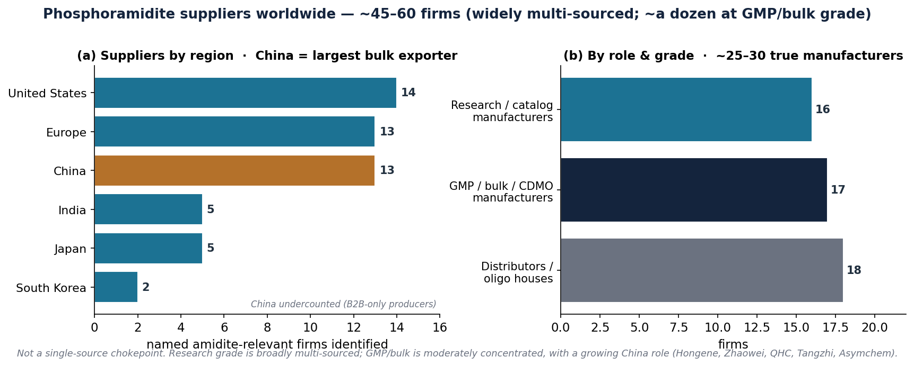

# The Phosphoramidite Supply Chain — A Biosecurity Monitorability & Control-Point Assessment

*Prepared for the "DNA Synthesis Screening Under Device Proliferation" project · defensive governance analysis · no synthesis procedures included*

**How to read this document.** Every quantitative claim is attributed to a named source. Market-size figures are commercial market-research estimates that disagree with one another; they are shown as a spread, not a consensus. A "Contacts / where to dig further" section lists the people and organisations to approach for the numbers that are not public.

## 1. Bottom line

Phosphoramidites are the commodity nucleoside "building blocks" of chemical DNA synthesis. For biosecurity purposes the assessment is two-sided and must be kept separate:

- **As a control lever, the danger is LOW.** Phosphoramidites are ordinary, unscheduled research chemicals sold by several dozen suppliers worldwide — on the order of 45–60 firms, of which ~25–30 are true chemical manufacturers — across the US, Europe and Asia; they are not export-controlled or subject to any purchase (KYC) requirement; and they are chemically substitutable — they can even be made on demand from more stable precursors (Sandahl et al., 2021, *Nature Communications*) and used with unregulated solvent substitutes (Kim, Kim & Bang, 2024, *Sci. Rep.* 14:3773). Restricting or monitoring them is therefore not a durable control point — consistent with this project's Chapter 2 finding and with how NTI/IBBIS/OSTP actually govern synthesis (they screen sequences and devices, not reagents).
- **As a supply-chain-resilience question, the concentration is real but is an economic/geopolitical issue, not a misuse chokepoint.** High-purity amidites and their upstream precursors come from a limited number of firms, with a growing bulk role in China (notably Hongene Biotech), which is why the US has begun reshoring the amidite/RNA-materials supply and why the BIOSECURE Act touches this space. That matters for drug-supply security, not for whether a bad actor can obtain reagents.

In one line: you cannot secure DNA synthesis by controlling phosphoramidites — the reagent is too commodity, too substitutable, and swamped by legitimate demand; control belongs at the sequence and the device.

## 2. What a phosphoramidite is (non-procedural)

A nucleoside phosphoramidite is a chemically "activated," protected form of one of the four DNA (or RNA) building blocks, used in automated solid-phase oligonucleotide synthesis. Each amidite carries a 5′-dimethoxytrityl (DMT) protecting group and a reactive phosphite group; it is produced by reacting a protected nucleoside with a phosphitylation reagent (2-cyanoethyl N,N-diisopropyl-chlorophosphoramidite / bis-amidite type). The four standard DNA amidites (dA, dC, dG, dT), plus modified/RNA amidites, are catalog items.

## 3. Supply-chain structure and where the chokepoints are

The chain, upstream → downstream:

1. **Raw/upstream inputs** — protected nucleosides ("PNS"), specialty protecting-group and phosphitylation reagents, controlled-pore-glass (CPG) solid supports.
2. **Amidite manufacturers/formulators** — convert protected nucleosides into finished phosphoramidites (research-grade and GMP-grade).
3. **Distributors / catalog suppliers** — sell to end users, each shipment with a Certificate of Analysis.
4. **End users** — (a) commercial gene-synthesis providers; (b) benchtop/DIY synthesizers; (c) therapeutic-oligonucleotide (ASO/siRNA/mRNA) manufacturers, now the dominant demand pull.

**Chokepoint analysis:**

- **No single firm or country is a monopoly chokepoint.** Research-grade amidites are multi-sourced across the US (Glen Research, ChemGenes, TriLink, Thermo Fisher), Europe (Merck/Germany, LGC/UK–Denmark, Biosynth/Switzerland) and Asia (Hongene, Shanghai Zhaowei, Tianjin Quanhecheng/QHC, Tangzhi, Huaren, Asymchem/China; Kaneka, Nitto, Ajinomoto, TCI/Japan; Bioneer, ST Pharm/Korea; Sai Life, Aragen/India). The right description is tier-and-region concentration, not a single point of failure.
- **The genuine concentration is upstream and at bulk/GMP scale.** Industry-engineering sources describe high-purity nucleoside phosphoramidites as critical raw materials produced by a "limited number of global suppliers," creating vulnerability to a single-facility or geopolitical disruption (ISPE Pharmaceutical Engineering, Nov–Dec 2025; CRB — Best practices in oligonucleotide manufacturing).
- **Analytical hypothesis (unconfirmed):** upstream protected-nucleoside/reagent production is probably *more* concentrated than amidite formulation, because formulation is a fairly standardised final step done by many firms whereas raw/protected-nucleoside and phosphitylation-reagent production is more capital- and chemistry-intensive and is prominently offered by vertically integrated Chinese producers (Hongene lists distinct upstream tiers — Nucleosides, Protected Nucleosides, nucleotides, linkers, reagents — hongene.com/products). No retrieved source quantifies this split; treat it as a reasoning-based hypothesis to confirm with an industry source (see Contacts).

## 4. Who makes them (manufacturers, HQ, role)

| Company | HQ / geography | Role / grade | Source |
|---|---|---|---|
| Glen Research | Sterling, Virginia, USA (Maravai LifeSciences) | Research-scale amidites & modifications | glenresearch.com/about-us |
| ChemGenes | Wilmington, Massachusetts, USA (est. 1981) | DNA/RNA amidites, CPG, nucleosides | chemgenes.com |
| LGC Biosearch Technologies | Petaluma & Novato, CA, USA + Denmark (LGC Group, UK) | GMP oligo/amidite manufacturing | lgcgroup.com |
| Merck KGaA / Sigma-Aldrich | Darmstadt, Germany | Catalog/research amidites & reagents | Coherent Market Insights |
| Thermo Fisher Scientific | Waltham, Massachusetts, USA | Amidites for oligo synthesis | thermofisher.com |
| Hongene Biotech | China (Shanghai); US subsidiary Union City, CA | Vertically integrated bulk raw materials + CDMO; 58 t/yr amidite capacity | Hongene capacity release |
| Shanghai Zhaowei Technology (兆维) | China (Shanghai; est. 2001) | One of few firms making high-quality amidite monomers + dNTP/NTP at scale | zhihu/兆维科技 |
| Tianjin Quanhecheng / QHC (全和诚) | China (Tianjin; est. 2010) | Nucleoside + phosphoramidite monomers (gene-testing/therapeutic) | quanhecheng |
| Tangzhi Pharmaceutical (糖智药业) | China (Wuhan/Qingdao/Panjin) | Nucleoside/amidite monomers; first amidite monomer with FDA DMF | bydrug/糖智 |
| Huaren Science | China (Wuhu) | Modified/RNA/LNA amidites; non-GMP + GMP, DMF support | huarenscience.com |
| Asymchem / Kailaiying (凯莱英) | China (Tianjin) | Oligo (ASO/siRNA) CDMO; supplies amidite monomers + GalNAc | asymchem.com |
| Biosynth (acq. Carbosynth) | Staad, Switzerland | Nucleosides & specialty synthesis chemicals | biosynth.com |
| TriLink BioTechnologies | San Diego, California, USA (Maravai) | Amidites, modified nucleotides | biospace.com |
| Kaneka (Eurogentec) | Osaka, Japan; subsidiary in Belgium | GMP oligonucleotide manufacturing | Kaneka news |
| Nitto Denko / Avecia | Osaka, Japan; Avecia in Milford, MA, USA | Oligo CDMO; ~US$226M expansion | Fierce Pharma |
| Ajinomoto Bio-Pharma / GeneDesign | Osaka, Japan | Largest GMP solid-phase oligo capability in Japan | Drug Dev. & Delivery |
| Bioneer | South Korea | Named market participant | Mordor company list |
| Lumiprobe | USA (Maryland) | Fluorescent + modified amidites | lumiprobe.com |
| PolyOrg Inc | USA (Massachusetts) | DNA/RNA + modified phosphoramidites | polyorginc.com |

**Market concentration (indicative, market-research estimate).** One vendor states the top six — Thermo Fisher, Merck, Danaher, LGC Biosearch, Qiagen, Hongene — hold ~60–70% of the phosphoramidite market (2024) (Coherent Market Insights). This is a research-firm estimate, not audited (and its grouping reflects parent companies, e.g. Danaher via IDT/Aldevron) — treat as directional.

**China / bulk role.** Hongene is described as the largest supplier of nucleic-acid raw materials used in mRNA COVID-19 vaccines and is expanding a vertically integrated "raw materials → CDMO" platform (PharmaSource). WuXi STA is reported to run 27 oligonucleotide production lines (Mordor Intelligence). The therapeutic-grade bulk chain (Hongene, WuXi STA, Nitto Avecia, Ajinomoto, Kaneka, CordenPharma) is functionally distinct from the research/benchtop catalog channel (Glen Research, Biosearch, Thermo) relevant to DIY — an inference from grade, scale and supplier positioning rather than a single explicit source.

### 4.1 Global supplier census (how many firms make/sell amidites?)

Contrary to a "~a dozen" impression, the reagent is made or sold by **several dozen firms worldwide — on the order of 45–60 identifiable suppliers, of which ~25–30 are true chemical manufacturers**. The field is *widely multi-sourced at research/catalog grade* and only *moderately concentrated at GMP/bulk grade* (~a dozen serious ton-scale producers). China is under-counted here because several bulk producers advertise only on Chinese-language B2B portals; a Chinese-language search added Shanghai Zhaowei, Tianjin Quanhecheng (QHC), Tangzhi Pharmaceutical, Huaren and Asymchem, and China is now the **largest exporter of nucleic-acid raw materials globally** (PHIRDA). Named firms by region: United States ~14, Europe ~13, China ~13 (undercounted), Japan ~5, India ~5, South Korea ~2.

*Figure. Phosphoramidite suppliers worldwide — ~45–60 firms (widely multi-sourced; ~a dozen at GMP/bulk grade). (a) named firms by region, China the largest bulk exporter; (b) by role and grade.*

**Implication:** the larger, better-resolved count *strengthens* the biosecurity conclusion. At research grade the reagent is emphatically not a chokepoint; the only real concentration is at therapeutic GMP/bulk scale, and that is a supply-resilience/economic issue (with a growing China role) — not a misuse-control lever.

## 5. Market size & structure (a spread of vendor estimates)

Base-year values cluster tightly (~US$1.1–1.2 billion, 2023–2025); forecasts to 2033–2034 diverge ~40%.

| Vendor | Base value | Forecast | CAGR | Source |
|---|---|---|---|---|
| Grand View Research (2024) | $1.08B (2023) | $1.76B by 2030 | 7.37% | GVR |
| Grand View Research (2025 revision) | — | $2.27B by 2033 | 8.06% | GVR press release |
| Mordor Intelligence | $1.20B (2025) | $1.74B by 2031 | 6.34% | Mordor |
| GMInsights | $1.2B (2024) | ~$2.4–2.45B by 2034 | 7.2% | GMInsights |
| Emergen Research | $1.2B (2024) | $2.4B by 2033 | 8.0% | Emergen |
| Astute Analytica | — | $2.44B by 2033 | 8.1% | Astute |
| Coherent Market Insights | $1.09B (2026) | $1.83B by 2033 | 7.7% | Coherent |

**Regional share.** North America is largest — 39.3% (Grand View, 2024) vs 44.1% (GMInsights, 2024) (vendors differ ~5 points). Asia-Pacific is the fastest-growing region (~9–10% CAGR); Europe is consistently third.

**Growth drivers (consistent across vendors).** Nucleic-acid therapeutics — antisense oligonucleotides, siRNA and mRNA — dominate; RNA phosphoramidites are the fastest-growing type; drug discovery is the largest application (GVR press release).

**Context — larger adjacent markets (do not conflate).** The broader "oligonucleotide synthesis" market is quoted anywhere from US$4.05B → $8.83B by 2030 (GVR) to US$24.7B by 2030 (MarketsandMarkets) — an order-of-magnitude gap that reflects scope-definition differences, not a real discrepancy. Use the phosphoramidite-specific figures for this report and cite the adjacent ones only as context.

## 6. Regulatory & control status (the monitorability question)

- **Not export-controlled or scheduled.** A targeted search of the Australia Group control lists (chemical-weapon precursors and dual-use bio equipment) and general US Commerce Control List material did not surface nucleoside phosphoramidites as controlled items — they are ordinary research chemicals, distinct from the specific toxic CW precursors the Australia Group lists. Framing note: this is a "not found on the control lists" finding, not a formal legal opinion — confirm with an export-control officer before asserting it definitively (see Contacts).
- **No purchase-side KYC.** There is no know-your-customer or licensing requirement to buy phosphoramidites. The screening regime that does exist — IGSC's Harmonized Protocol and the OSTP Framework — screens the synthesized sequence and the customer of a synthesis order, not the reagent buyer (OSTP Framework, Sept 2024; IBBIS Common Mechanism).
- **Why governance deliberately avoids reagent controls.** Biosecurity policy converges on screening sequences and devices rather than reagents, because restrictions on tangible, ubiquitous dual-use items are easy to circumvent and would burden overwhelmingly legitimate use (Rose et al., 2024, *Practical Questions for Securing Nucleic Acid Synthesis*; Diggans & Leproust, 2019, *Next Steps for Access to Safe, Secure DNA Synthesis*; a 2026 risk-based oversight framework, Frontiers in Bioengineering and Biotechnology).

## 7. Biosecurity risk / "how dangerous" — calibrated

**As a misuse-control lever: LOW.** Reasons, each evidenced:

1. **Commodity & multi-sourced** — several dozen independent global suppliers (~45–60; §4); restricting one is routed around.
2. **Substitutable at the reagent level** — phosphoramidites can be synthesized on demand from more stable parent alcohols in flow, near-quantitatively and without purification, "potentially operated by non-chemists," removing the storage/stability barrier that is a reagent supply's only natural friction (Sandahl, Nguyen, Hansen, Johansen, Skrydstrup & Gothelf, 2021, *Nat. Commun.* 12:2760).
3. **Substitutable at the solvent level** — the associated solvent (acetonitrile) can be replaced by propylene carbonate, an unregulated GRAS food additive, in DIY synthesis (Kim, Kim & Bang, 2024).
4. **Legitimate demand dwarfs any misuse signal** — a ~$1.1B and double-digit-growth market driven by therapeutics/diagnostics/research (§5) means purchase data carries essentially no discriminating signal for misuse.
5. **The reagent is not itself hazardous** — phosphoramidites are lab chemicals, not toxins or weapons; their only biosecurity relevance is as an enabler of synthesis, and synthesis is better governed downstream (sequence + device).

This directly corroborates the project's Chapter 2 conclusion that supply-chain restriction is not a durable control point under either regime.

**As a supply-chain-resilience issue: MEDIUM — but a different problem.** The bulk/GMP amidite supply is geographically concentrated, with a growing Chinese role. This is why the US has moved to first-shore genetic-medicine and RNA-materials manufacturing — for example ARPA-H's GIVE program (Genetic medicines and Individualized manufacturing for everyone), which funds automated RNA manufacturing and integrated quality control to on-shore genetic-medicine production (arpa-h.gov) — and why the **BIOSECURE Act**, enacted as **Section 851 of the FY2026 National Defense Authorization Act (P.L. 119-60, signed 18 December 2025)**, restricts US federal agencies from contracting with named Chinese "biotechnology companies of concern." Both are economic/drug-security policy, not misuse chokepoints, and should be labelled as such in the thesis so the two risks are not conflated.

## 8. Monitoring feasibility & realistic options

Given §6–7, monitoring who buys phosphoramidites is largely infeasible and low-value as a biosecurity measure:

- **What would be required:** a KYC/registration regime on reagent sales (none exists), harmonised internationally (or buyers shift to foreign suppliers), covering both finished amidites and the parent alcohols/precursors (or the on-demand synthesis routes around them). The cost/burden falls almost entirely on legitimate users.
- **Why it fails:** the same substitutability and legitimate-demand arguments in §7; a reagent-purchase signal cannot distinguish a benign lab from a misuse actor.
- **Where monitoring is tractable and already the focus:** the synthesis order (sequence + customer screening, IGSC/OSTP), the device (on-device screening for benchtop synthesizers), and post-hoc attribution (this project's Chapter 4). Reagent monitoring, if pursued at all, is a distant fourth and mainly useful for supply-chain resilience (mapping dependency on Chinese bulk suppliers), not misuse detection.

**Recommended framing for the thesis:** treat phosphoramidite supply as (a) confirming the "reagent restriction is not durable" finding, and (b) a separate resilience/economic-security note about Chinese bulk concentration — explicitly not a monitorable misuse chokepoint.

## 9. Contacts / where to dig further

For figures that are not public (production volumes, buyer lists, real diversion data, licensed market data):

- **IBBIS** — International Biosecurity and Biosafety Initiative for Science (Piers Millett, Exec. Dir.) — authoritative on why governance screens sequences/devices not reagents; your infohazard-review body. ibbis.bio
- **NTI | bio** (Nuclear Threat Initiative) — benchtop-synthesis and supply-chain governance reports; original convenor of the DNA-synthesis screening consortium. nti.org/about/biosecurity
- **Rob Carlson** — synthesis.cc / Planetary Technologies — the authority on DNA-synthesis cost and market trajectories; for reconciling the vendor market-size spread in §5. synthesis.cc
- **Prof. Kurt V. Gothelf** — Aarhus University (iNANO) — senior author of the on-demand phosphoramidite-synthesis paper (§7); the person to ask on how far reagent substitutability has advanced. chem.au.dk/en/kvg
- **Market-research firms** (Grand View Research, Mordor Intelligence, Coherent Market Insights, GMInsights) — hold the licensed, full market data behind the paywalled summaries; the source for verifying the top-6 concentration and regional shares.
- **ISPE / the oligonucleotide-manufacturing community and the TIDES conference** — for real bulk/GMP capacity data and the upstream-vs-formulation concentration question (§3). ispe.org
- **ARPA-H** — to characterise US first-shoring of genetic-medicine/RNA-materials manufacturing (the GIVE program) and any amidite-specific supply work. arpa-h.gov
- **An institutional export-control officer / BIS** (US Bureau of Industry and Security) — to obtain a formal statement that phosphoramidites are not on the CCL/Australia Group lists (§6), rather than relying on a "not found in search" result.
- **Hongene Biotech, WuXi STA, Nitto Avecia** (investor-relations/press) — for company-confirmed capacity numbers beyond the one verified figure (Hongene 58 t/yr).

## 10. References

**Peer-reviewed / primary**
- Sandahl, A. F., Nguyen, T. J. D., Hansen, R. A., Johansen, M. B., Skrydstrup, T., & Gothelf, K. V. (2021). On-demand synthesis of phosphoramidites. *Nature Communications*, 12, 2760. https://doi.org/10.1038/s41467-021-22945-z
- Kim, J., Kim, H., & Bang, D. (2024). An open-source, 3D printed inkjet DNA synthesizer. *Scientific Reports*, 14, 3773. https://doi.org/10.1038/s41598-024-53944-x
- Rose, S., Alexanian, T., Langenkamp, M., Cozzarini, H., & Diggans, J. (2024). Practical Questions for Securing Nucleic Acid Synthesis. *Applied Biosafety*. https://doi.org/10.1089/apb.2023.0028
- Diggans, J., & Leproust, E. (2019). Next Steps for Access to Safe, Secure DNA Synthesis. *Frontiers in Bioengineering and Biotechnology*, 7, 86. https://doi.org/10.3389/fbioe.2019.00086
- A risk-based framework to guide oversight of nucleic acid constructs (2026). *Frontiers in Bioengineering and Biotechnology*. https://doi.org/10.3389/fbioe.2026.1870125

**Policy / governance**
- OSTP (2024). Framework for Nucleic Acid Synthesis Screening. https://aspr.hhs.gov/S3/
- IBBIS — Common Mechanism for DNA Synthesis Screening. https://ibbis.bio/our-work/common-mechanism/
- The Australia Group — Chemical Weapons Precursor control list. https://www.dfat.gov.au/publications/minisite/theaustraliagroupnet/site/en/precursors.html
- BIOSECURE Act — enacted as §851 of the FY2026 National Defense Authorization Act (P.L. 119-60), signed 18 December 2025.
- ARPA-H — GIVE program (Genetic medicines and Individualized manufacturing for everyone). https://arpa-h.gov/explore-funding/programs/give

**Company / industry**
- Hongene Biotech — Phosphoramidite capacity (58 t/yr). https://www.hongene.com/news/hongene-expands-phosphoramidite-production-capability-to-58-t
- Glen Research; ChemGenes; LGC Biosearch Technologies; Thermo Fisher (Phosphoramidites); Nitto Denko / Avecia (~$226M expansion, Fierce Pharma); Ajinomoto / GeneDesign; ISPE (oligonucleotide manufacturing, 2025); CRB (best practices in oligonucleotide manufacturing).
- Chinese-language sources (supplier census): Shanghai Zhaowei Technology (兆维科技, zhihu.com/p/525287912); Tangzhi Pharmaceutical FDA-DMF filing (糖智药业, bydrug.pharmcube.com); PHIRDA — China is the largest exporter of nucleic-acid raw materials (phirda.com/artilce_29089); Huaren Science (huarenscience.com); Asymchem oligonucleotides (asymchem.com).

**Market research (vendor estimates — figures disagree; see §5)**
- Grand View Research; Mordor Intelligence; GMInsights; Coherent Market Insights; Emergen Research; Astute Analytica.

---

*Verification note (this revision): the "Practical Questions" citation was corrected to Rose et al. 2024; the BIOSECURE Act status was confirmed (enacted §851, FY2026 NDAA, 18 Dec 2025); Lumiprobe (Maryland, US) and PolyOrg (Massachusetts, US) HQs were confirmed; and two figures that could not be verified against a primary source — an ARPA-H "$1.5B / $320M amidite" line and an APAC "24.9% / $285.2M" share — were removed. Remaining market-size figures are attributed vendor estimates shown as a spread.*
